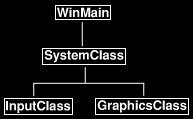

[原文链接](http://www.rastertek.com/dx11s2tut02.html)

在开始使用 DirectX 11 编码之前，我建议构建一个简单的代码框架。该框架将处理基本的窗口功能，并为学习 DirectX 11 提供一种以有组织和可读的方式扩展代码的简单方法。由于这些教程的目的只是尝试 DirectX 11 的不同功能，而不是构建完整的渲染引擎，所以我们将有目的地尽可能保持框架精简。一旦你掌握了DirectX 11，你就可以研究如何构建一个现代化的图形渲染引擎。

## 框架简介

框架从以下四部分着手搭建：
1. `WinMain` 函数来处理应用程序的入口点。
2. 定义 `SystemClass`，封装从 `WinMain` 函数中调用的整个应用程序
3. 在系统类中，我们定义 `GraphicsClass` 来处理 DirectX 图形代码；
4. 除此之外，定义 `InputClass` 来处理用户的输入。

框架设置示意图如下：  


## WinMain

```cpp
////////////////////////////////////////////////////////////////////////////////
// Filename: main.cpp
////////////////////////////////////////////////////////////////////////////////
#include "systemclass.h"


int WINAPI WinMain(HINSTANCE hInstance, HINSTANCE hPrevInstance, PSTR pScmdline, int iCmdshow)
{
	SystemClass* System;
	bool result;
	
	
	// Create the system object.
	System = new SystemClass;
	if(!System)
	{
		return 0;
	}

	// Initialize and run the system object.
	result = System->Initialize();
	if(result)
	{
		System->Run();
	}

	// Shutdown and release the system object.
	System->Shutdown();
	delete System;
	System = 0;

	return 0;
}
```

正如您所见，我们保持了 `WinMain` 函数的简单性。我们创建 `SystemClass`，然后初始化它。如果初始化没有问题，那么我们调用 `SystemClass` 的 `Run` 函数。

`Run` 函数将运行自己的循环并执行所有应用程序代码，直到完成所有逻辑。

`Run` 函数完成后，我们关闭 `SystemClass` 并对资源进行清理。

因此，我们保持了它的简单性，并将整个应用程序封装在系统类中。

现在让我们来看一下 `SystemClass` 头文件：

## Systemclass.h

```cpp
////////////////////////////////////////////////////////////////////////////////
// Filename: systemclass.h
////////////////////////////////////////////////////////////////////////////////
#ifndef _SYSTEMCLASS_H_
#define _SYSTEMCLASS_H_
```

这里我们定义 `WIN32_LEAN_AND_MEAN`。我们这样做是为了加快构建过程：这个宏将通过排除一些较少使用的 API 来减少 Win32 头文件的大小。

```cpp
///////////////////////////////
// PRE-PROCESSING DIRECTIVES //
///////////////////////////////
#define WIN32_LEAN_AND_MEAN
```

此时，我们已经在框架中包含了其他两个类的头文件，因此我们可以在 `SystemClass` 中使用它们。

```cpp
///////////////////////
// MY CLASS INCLUDES //
///////////////////////
#include "inputclass.h"
#include "graphicsclass.h"
```

将 `Windows.h` 包含在内，我们才可以通过调用函数来创建或者销毁窗口，并能够使用其他有用的 Win32 函数。

```cpp
//////////////
// INCLUDES //
//////////////
#include <windows.h>
```

这个类的定义相当简单，我们可以看到，`WinMain` 中调用的 `Initialize`、`Shutdown` 和 `Run` 函数都是在这里定义的。

除此之外，还有一些私有函数将在这些函数中调用。

我们还在类中添加了 `MessageHandler` 函数来处理 Windows 系统的消息，这些消息将在应用程序运行时发送到应用程序。

最后，我们定义连个私有变量：`m_Input` 和 `m_Graphics`，它们将分别指向处理输入和图形的两个系统对象。

```cpp
////////////////////////////////////////////////////////////////////////////////
// Class name: SystemClass
////////////////////////////////////////////////////////////////////////////////
class SystemClass
{
public:
	SystemClass();
	SystemClass(const SystemClass&);
	~SystemClass();

	bool Initialize();
	void Shutdown();
	void Run();

	LRESULT CALLBACK MessageHandler(HWND, UINT, WPARAM, LPARAM);

private:
	bool Frame();
	void InitializeWindows(int&, int&);
	void ShutdownWindows();

private:
	LPCWSTR m_applicationName;
	HINSTANCE m_hinstance;
	HWND m_hwnd;

	InputClass* m_Input;
	GraphicsClass* m_Graphics;
};


/////////////////////////
// FUNCTION PROTOTYPES //
/////////////////////////
static LRESULT CALLBACK WndProc(HWND, UINT, WPARAM, LPARAM);


/////////////
// GLOBALS //
/////////////
static SystemClass* ApplicationHandle = 0;


#endif
```

`WndProc` 函数和 `ApplicationHandle` 指针也包含在这个类文件中，因此我们可以在 `SystemClass` 中将 Windows 系统的消息重定向到我们自己的 `MessageHandler` 函数中。

现在让我们看看 `SystemClass` 源文件：

## Systemclass.cpp

```cpp
////////////////////////////////////////////////////////////////////////////////
// Filename: systemclass.cpp
////////////////////////////////////////////////////////////////////////////////
#include "systemclass.h"
```

在类构造函数中，我将成员对象指针初始化为空，这一点很重要，因为如果这些对象的初始化失败，那么接下来的 `Shutdown` 函数将尝试清理这些对象。

如果对象不为空，那么它会假定它们是被有效创建的对象，并且他们需要被清理。

将应用程序中的所有指针和变量初始化为空也是一种很好的习惯，如果不这样做，某些发布版本可能将生成失败。

```cpp
SystemClass::SystemClass()
{
	m_Input = 0;
	m_Graphics = 0;
}
```

在这里，我创建了一个空的拷贝构造函数和空的析构函数，在这个类中，我不需要它们，但如果没有定义，一些编译器将为您生成它们，既然这样的话，我更希望它们是空的。

你也会注意到我没有在析构函数中进行任何对象的清理工作，相反，我会在 `Shutdown` 函数中清理所有对象，关于这些内容你会在下面看到。

我这样做的原因是我不信任它总是会被调用：某些 Windows 函数（如 `ExitThread()`）不调用类析构函数，这会导致内存泄漏。当然，现在的你可以调用这些函数的安全版本，但我只是在 Windows 上编程时更加小心。

```cpp
SystemClass::SystemClass(const SystemClass& other)
{
}


SystemClass::~SystemClass()
{
}
```

下面的初始化函数将完成应用程序的所有设置：首先调用 `InitializeWindows` 函数，它将创建应用程序要使用的窗口，然后创建和初始化应用程序将用于处理用户输入的 input 对象和向屏幕输出图形的 graphics 对象。

```cpp
bool SystemClass::Initialize()
{
	int screenWidth, screenHeight;
	bool result;


	// Initialize the width and height of the screen to zero before sending the variables into the function.
	screenWidth = 0;
	screenHeight = 0;

	// Initialize the windows api.
	InitializeWindows(screenWidth, screenHeight);

	// Create the input object.  This object will be used to handle reading the keyboard input from the user.
	m_Input = new InputClass;
	if(!m_Input)
	{
		return false;
	}

	// Initialize the input object.
	m_Input->Initialize();

	// Create the graphics object.  This object will handle rendering all the graphics for this application.
	m_Graphics = new GraphicsClass;
	if(!m_Graphics)
	{
		return false;
	}

	// Initialize the graphics object.
	result = m_Graphics->Initialize(screenWidth, screenHeight, m_hwnd);
	if(!result)
	{
		return false;
	}
	
	return true;
}
```

`Shutdown` 函数进行清理工作：它会关闭并释放与图形和输入对象相关的所有内容。此外，它还关闭窗口并清理与之相关的句柄。

```cpp
void SystemClass::Shutdown()
{
	// Release the graphics object.
	if(m_Graphics)
	{
		m_Graphics->Shutdown();
		delete m_Graphics;
		m_Graphics = 0;
	}

	// Release the input object.
	if(m_Input)
	{
		delete m_Input;
		m_Input = 0;
	}

	// Shutdown the window.
	ShutdownWindows();
	
	return;
}
```

`Run` 函数是应用程序循环并执行所有应用程序逻辑的地方，直到我们决定退出。

应用程序逻辑在每次循环都被调用的 `Frame` 函数中完成。这是一个需要理解的重要概念，因为在编写应用程序的其余部分时，必须牢记这一点。

伪代码如下所示：

```
while not 程序退出
    检查 Windows 系统消息
    处理系统消息
    执行应用程序主循环
    检查用户是否想要退出程序
```

```cpp
void SystemClass::Run()
{
	MSG msg;
	bool done, result;


	// Initialize the message structure.
	ZeroMemory(&msg, sizeof(MSG));
	
	// Loop until there is a quit message from the window or the user.
	done = false;
	while(!done)
	{
		// Handle the windows messages.
		if(PeekMessage(&msg, NULL, 0, 0, PM_REMOVE))
		{
			TranslateMessage(&msg);
			DispatchMessage(&msg);
		}

		// If windows signals to end the application then exit out.
		if(msg.message == WM_QUIT)
		{
			done = true;
		}
		else
		{
			// Otherwise do the frame processing.
			result = Frame();
			if(!result)
			{
				done = true;
			}
		}

	}

	return;
}
```

下面的 `Frame` 函数是完成应用程序所有逻辑的地方。

到目前为止，它相当简单，我们检查 input 对象，看看用户是否按下了 escape 键并想退出；如果他们不想退出，那么我们调用 graphics 对象来为该帧渲染图形。

随着应用程序的逐渐复杂，我们将在这里放置更多代码。

```cpp
bool SystemClass::Frame()
{
	bool result;


	// Check if the user pressed escape and wants to exit the application.
	if(m_Input->IsKeyDown(VK_ESCAPE))
	{
		return false;
	}

	// Do the frame processing for the graphics object.
	result = m_Graphics->Frame();
	if(!result)
	{
		return false;
	}

	return true;
}
```

`MessageHandler` 函数是我们处理 Windows 系统消息的地，我们可以监听我们感兴趣的信息。

目前，我们只需读取某个键是否被按下或被释放，然后将该信息传递给 input 对象，所有的其他消息我没将传递给 Windows 默认的消息处理函数来处理。

```cpp
LRESULT CALLBACK SystemClass::MessageHandler(HWND hwnd, UINT umsg, WPARAM wparam, LPARAM lparam)
{
	switch(umsg)
	{
		// Check if a key has been pressed on the keyboard.
		case WM_KEYDOWN:
		{
			// If a key is pressed send it to the input object so it can record that state.
			m_Input->KeyDown((unsigned int)wparam);
			return 0;
		}

		// Check if a key has been released on the keyboard.
		case WM_KEYUP:
		{
			// If a key is released then send it to the input object so it can unset the state for that key.
			m_Input->KeyUp((unsigned int)wparam);
			return 0;
		}

		// Any other messages send to the default message handler as our application won't make use of them.
		default:
		{
			return DefWindowProc(hwnd, umsg, wparam, lparam);
		}
	}
}
```

`InitializeWindows` 函数内我们编写用于构建渲染窗口的代码。它将 `screenWidth` 和 `screenHeight` 返回给调用函数，以便我们可以在整个应用程序中使用它们。

我们使用一些默认设置来创建并初始化窗口一个纯黑的无边框窗口。

该函数将根据名为 `FULL_SCREEN` 的全局变量来决定是生成一个小窗口还是一个全屏窗口。如果设置为 `true`，那么我们将使屏幕覆盖整个用户桌面窗口；如果设置为 `false`，我们只需在屏幕中间创建一个 800×600 的窗口。我将 `FULL_SCREEN` 全局变量放到了 `graphicsclass.h` 文件的顶部以便修改。

稍后你将理解为什么我将这个全局变量放在该文件内，而不是该文件所包含的其他头文件中。

```cpp
void SystemClass::InitializeWindows(int& screenWidth, int& screenHeight)
{
	WNDCLASSEX wc;
	DEVMODE dmScreenSettings;
	int posX, posY;


	// Get an external pointer to this object.	
	ApplicationHandle = this;

	// Get the instance of this application.
	m_hinstance = GetModuleHandle(NULL);

	// Give the application a name.
	m_applicationName = L"Engine";

	// Setup the windows class with default settings.
	wc.style         = CS_HREDRAW | CS_VREDRAW | CS_OWNDC;
	wc.lpfnWndProc   = WndProc;
	wc.cbClsExtra    = 0;
	wc.cbWndExtra    = 0;
	wc.hInstance     = m_hinstance;
	wc.hIcon         = LoadIcon(NULL, IDI_WINLOGO);
	wc.hIconSm       = wc.hIcon;
	wc.hCursor       = LoadCursor(NULL, IDC_ARROW);
	wc.hbrBackground = (HBRUSH)GetStockObject(BLACK_BRUSH);
	wc.lpszMenuName  = NULL;
	wc.lpszClassName = m_applicationName;
	wc.cbSize        = sizeof(WNDCLASSEX);
	
	// Register the window class.
	RegisterClassEx(&wc);

	// Determine the resolution of the clients desktop screen.
	screenWidth  = GetSystemMetrics(SM_CXSCREEN);
	screenHeight = GetSystemMetrics(SM_CYSCREEN);

	// Setup the screen settings depending on whether it is running in full screen or in windowed mode.
	if(FULL_SCREEN)
	{
		// If full screen set the screen to maximum size of the users desktop and 32bit.
		memset(&dmScreenSettings, 0, sizeof(dmScreenSettings));
		dmScreenSettings.dmSize       = sizeof(dmScreenSettings);
		dmScreenSettings.dmPelsWidth  = (unsigned long)screenWidth;
		dmScreenSettings.dmPelsHeight = (unsigned long)screenHeight;
		dmScreenSettings.dmBitsPerPel = 32;			
		dmScreenSettings.dmFields     = DM_BITSPERPEL | DM_PELSWIDTH | DM_PELSHEIGHT;

		// Change the display settings to full screen.
		ChangeDisplaySettings(&dmScreenSettings, CDS_FULLSCREEN);

		// Set the position of the window to the top left corner.
		posX = posY = 0;
	}
	else
	{
		// If windowed then set it to 800x600 resolution.
		screenWidth  = 800;
		screenHeight = 600;

		// Place the window in the middle of the screen.
		posX = (GetSystemMetrics(SM_CXSCREEN) - screenWidth)  / 2;
		posY = (GetSystemMetrics(SM_CYSCREEN) - screenHeight) / 2;
	}

	// Create the window with the screen settings and get the handle to it.
	m_hwnd = CreateWindowEx(WS_EX_APPWINDOW, m_applicationName, m_applicationName, 
				WS_CLIPSIBLINGS | WS_CLIPCHILDREN | WS_POPUP,
				posX, posY, screenWidth, screenHeight, NULL, NULL, m_hinstance, NULL);

	// Bring the window up on the screen and set it as main focus.
	ShowWindow(m_hwnd, SW_SHOW);
	SetForegroundWindow(m_hwnd);
	SetFocus(m_hwnd);

	// Hide the mouse cursor.
	ShowCursor(false);

	return;
}
```

`ShutdownWindows` 函数仅仅是将屏幕设置恢复正常，并释放窗口及其相关的句柄。

```cpp
void SystemClass::ShutdownWindows()
{
	// Show the mouse cursor.
	ShowCursor(true);

	// Fix the display settings if leaving full screen mode.
	if(FULL_SCREEN)
	{
		ChangeDisplaySettings(NULL, 0);
	}

	// Remove the window.
	DestroyWindow(m_hwnd);
	m_hwnd = NULL;

	// Remove the application instance.
	UnregisterClass(m_applicationName, m_hinstance);
	m_hinstance = NULL;

	// Release the pointer to this class.
	ApplicationHandle = NULL;

	return;
}
```

`WndProc` 函数是 Windows 系统发送消息的目的地，你可以注意到，当我们在 `InitializeWindows` 函数顶部使用 `wc.lpfnWndProc = WndProc` 初始化窗口类的时候，就已经告诉了 Windows 系统回调函数的名字。我将其包含在这个类文件中，因为我们让它将所有消息发送到 `SystemClass` 中定义的 `MessageHandler` 函数，从而将其直接绑定到 `system` 类中。这使我们能够将消息传递功能直接挂接到类中，并保持代码整洁。

```cpp
LRESULT CALLBACK WndProc(HWND hwnd, UINT umessage, WPARAM wparam, LPARAM lparam)
{
	switch(umessage)
	{
		// Check if the window is being destroyed.
		case WM_DESTROY:
		{
			PostQuitMessage(0);
			return 0;
		}

		// Check if the window is being closed.
		case WM_CLOSE:
		{
			PostQuitMessage(0);		
			return 0;
		}

		// All other messages pass to the message handler in the system class.
		default:
		{
			return ApplicationHandle->MessageHandler(hwnd, umessage, wparam, lparam);
		}
	}
}
```