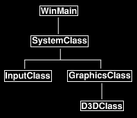

# 教程3：初始化 DirectX 11

[原文链接](http://www.rastertek.com/dx11s2tut03.html)

本教程将首次介绍如何使用DirectX 11，我们将讨论如何初始化和关闭 Direct3D，以及如何将内容渲染到窗口。

## 更新后的框架

我们将向框架中添加另一个类，该类将处理所有 Direct3D 系统的功能。我们称之为 `D3DClass`，更新后的框架图如下：



正如你所见，`D3DClass` 位于 `GraphicsClass` 内部；在之前的教程提到过，所有与图形有关的类都将封装在 `GraphicsClass` 中，所以我们新增的 `D3DClass` 类放到这里最为合适。

现在，让我们看看对 `GraphicsClass` 所做的更改。

## Graphicsclass.h

```cpp
////////////////////////////////////////////////////////////////////////////////
// Filename: graphicsclass.h
////////////////////////////////////////////////////////////////////////////////
#ifndef _GRAPHICSCLASS_H_
#define _GRAPHICSCLASS_H_
```

这里是第一处修改：我们移除了 `Windows.h` 并且使用了新的 `d3dclass.h` 来替代它。

```cpp
///////////////////////
// MY CLASS INCLUDES //
///////////////////////
#include "d3dclass.h"

/////////////
// GLOBALS //
/////////////
const bool FULL_SCREEN = false;
const bool VSYNC_ENABLED = true;
const float SCREEN_DEPTH = 1000.0f;
const float SCREEN_NEAR = 0.1f;


////////////////////////////////////////////////////////////////////////////////
// Class name: GraphicsClass
////////////////////////////////////////////////////////////////////////////////
class GraphicsClass
{
public:
	GraphicsClass();
	GraphicsClass(const GraphicsClass&);
	~GraphicsClass();

	bool Initialize(int, int, HWND);
	void Shutdown();
	bool Frame();

private:
	bool Render();

private:
```

第二处变化是新增的指向 `D3DClass` 的私有指针，我们称之为 `m_Direct3D`。

你可能好奇为什么我给所有的类内成员变量都加上 `m_` 前缀，这是因为当我编写代码时，我可以快速记起哪些变量是类的成员，而哪些不是。

```cpp
    D3DClass* m_Direct3D;
};

#endif
```

## Graphicsclass.cpp

在上一个教程中，这个类完全是空的，里面没有任何代码，现在我们有了一个 `D3DClass` 成员，我们将开始在 `GraphicsClass` 中填写一些代码来初始化和关闭 `D3DClass` 对象。

我们还将在 `Render` 函数中添加对 `BeginScene` 和 `EndScene` 的调用，以便现在使用 Direct3D 绘制窗口。

```cpp
////////////////////////////////////////////////////////////////////////////////
// Filename: graphicsclass.cpp
////////////////////////////////////////////////////////////////////////////////
#include "graphicsclass.h"
```

所以第一处变化是在类构造函数中：为了安全起见，这里我们将指针初始化为空，就像我们对所有类指针所做的那样。

```cpp
GraphicsClass::GraphicsClass()
{
	m_Direct3D = 0;
}


GraphicsClass::GraphicsClass(const GraphicsClass& other)
{
}


GraphicsClass::~GraphicsClass()
{
}
```

第二个变化是 `GraphicsClass` 中的 `Initialize` 函数：这里我们创建 `D3DClass` 对象，然后调用 `D3DClass` 的  `Initialize`函数；我们向这个函数传递屏幕宽度、屏幕高度、窗口句柄以及在 Graphicsclass.h 文件中定义的四个全局变量，`D3DClass` 将使用这些变量来设置 `Direct3D` 系统。

让我们更深入地讨论一下 d3dclass.cpp 文件中的内容。

```cpp
bool GraphicsClass::Initialize(int screenWidth, int screenHeight, HWND hwnd)
{
	bool result;


	// Create the Direct3D object.
	m_Direct3D = new D3DClass;
	if (!m_Direct3D)
	{
		return false;
	}

	// Initialize the Direct3D object.
	result = m_Direct3D->Initialize(screenWidth, screenHeight, VSYNC_ENABLED, hwnd, FULL_SCREEN, SCREEN_DEPTH, SCREEN_NEAR);
	if (!result)
	{
		MessageBox(hwnd, L"Could not initialize Direct3D", L"Error", MB_OK);
		return false;
	}

	return true;
}
```

下一处变化是 `GraphicsClass` 中的 `Shutdown` 函数。所有图形对象的关闭都在这里处理，因此我们将 `D3DClass` 的关闭也放在这个函数中。

请注意，我在这里检查指针了是否已经被初始化，如果没有，我们可以嘉定它从未被设置过，所以我们不会试图关闭它；这就是为什么在类构造函数中将所有指针设置为空是很重要的原因，如果确实发现指针已经初始化，那么我们将尝试关闭 `D3DClass`，然后清理指针。

```cpp
void GraphicsClass::Shutdown()
{
	// Release the Direct3D object.
	if (m_Direct3D)
	{
		m_Direct3D->Shutdown();
		delete m_Direct3D;
		m_Direct3D = 0;
	}

	return;
}
```

`Frame` 函数已经更新，现在它在每一帧里面调用 `Render` 函数。

```cpp
bool GraphicsClass::Frame()
{
	bool result;


	// Render the graphics scene.
	result = Render();
	if (!result)
	{
		return false;
	}

	return true;
}
```

该类的最后一个更改是在 `Render` 函数中。我们通过调用 `m_Direct3D` 对象来将屏幕清空为灰色；随后，我们调用`EndScene` 来将灰色显示到窗口中。

```cpp
bool GraphicsClass::Render()
{
	// Clear the buffers to begin the scene.
	m_Direct3D->BeginScene(0.5f, 0.5f, 0.5f, 1.0f);


	// Present the rendered scene to the screen.
	m_Direct3D->EndScene();

	return true;
}
```

## D3dclass.h

```cpp
////////////////////////////////////////////////////////////////////////////////
// Filename: d3dclass.h
////////////////////////////////////////////////////////////////////////////////
#ifndef _D3DCLASS_H_
#define _D3DCLASS_H_
```

头文件中的第一件事是指定使用此对象模块时要链接的库：第一个库包含用于在 DirectX 11 中设置和绘制 3D 图像的所有 Direct3D 函数；第二个库包含与计算机上的硬件进行通信工具，以获取显示器刷新率、正在使用的显卡等信息；第三个库包含编译着色器的功能，我们将在下一篇教程中介绍它。

```cpp
/////////////
// LINKING //
/////////////
#pragma comment(lib, "d3d11.lib")
#pragma comment(lib, "dxgi.lib")
#pragma comment(lib, "d3dcompiler.lib")
```

接下来，我们要做的是包含这些链接库对应的头文件，以及 DirectX 类型定义和数学功能头文件。

```cpp
//////////////
// INCLUDES //
//////////////
#include <d3d11.h>
#include <directxmath.h>
using namespace DirectX;
```

`D3DClass` 的类定义在这里尽可能保持简单：它有默认构造函数、复制构造函数和析构函数；更重要的是，它有 `Initialize` 和 `Shutdown` 函数，这将是我们在本篇教程中主要关注的内容。除此之外，当我们阅读 d3dclass.cpp 文件时，还会发现一些并不重要的辅助函数和私有成员变量，目前，我们只需要了解初始化和关闭功能。

```cpp
////////////////////////////////////////////////////////////////////////////////
// Class name: D3DClass
////////////////////////////////////////////////////////////////////////////////
class D3DClass
{
public:
	D3DClass();
	D3DClass(const D3DClass&);
	~D3DClass();

	bool Initialize(int, int, bool, HWND, bool, float, float);
	void Shutdown();
	
	void BeginScene(float, float, float, float);
	void EndScene();

	ID3D11Device* GetDevice();
	ID3D11DeviceContext* GetDeviceContext();

	void GetProjectionMatrix(XMMATRIX&);
	void GetWorldMatrix(XMMATRIX&);
	void GetOrthoMatrix(XMMATRIX&);

	void GetVideoCardInfo(char*, int&);

private:
	bool m_vsync_enabled;
	int m_videoCardMemory;
	char m_videoCardDescription[128];
	IDXGISwapChain* m_swapChain;
	ID3D11Device* m_device;
	ID3D11DeviceContext* m_deviceContext;
	ID3D11RenderTargetView* m_renderTargetView;
	ID3D11Texture2D* m_depthStencilBuffer;
	ID3D11DepthStencilState* m_depthStencilState;
	ID3D11DepthStencilView* m_depthStencilView;
	ID3D11RasterizerState* m_rasterState;
	XMMATRIX m_projectionMatrix;
	XMMATRIX m_worldMatrix;
	XMMATRIX m_orthoMatrix;
};

#endif
```

对于那些已经熟悉 Direct3D 的人，你可能会注意到我在这个类中没有视图矩阵变量。原因是，我将把它放在一个相机类，我们将在接下来的教程中看到。

## D3dclass.cpp

```cpp
////////////////////////////////////////////////////////////////////////////////
// Filename: d3dclass.cpp
////////////////////////////////////////////////////////////////////////////////
#include "d3dclass.h"
```

像大多数类一样，我们从在构造函数中将所有成员指针初始化为空开始，头文件中所有指针都需要考虑到。

```cpp
D3DClass::D3DClass()
{
	m_swapChain = 0;
	m_device = 0;
	m_deviceContext = 0;
	m_renderTargetView = 0;
	m_depthStencilBuffer = 0;
	m_depthStencilState = 0;
	m_depthStencilView = 0;
	m_rasterState = 0;
}


D3DClass::D3DClass(const D3DClass& other)
{
}


D3DClass::~D3DClass()
{
}
```

初始化函数为 DirectX 11 的 Direct3D 提供全部的设置功能。我已经在这里放置了所有必要的代码，以及一些额外的东西，将有助于将来的教程。我本可以简化它，并删除一些项目，但最好是在一个专门的教程中涵盖所有这些内容。

这个函数的 `screenWidth` 和 `screenHeight` 参数是我们在 `SystemClass` 中创建的窗口的宽度和高度。Direct3D将使用它们来初始化和使用相同的窗口尺寸。

`hwnd` 变量是窗口的句柄，Direct3D 需要此句柄才能访问先前创建的窗口。

`fullscreen` 参数来决定我们在窗口模式还是全屏模式下运行，Direct3D 也需要这一点来创建具有正确设置的窗口。

`screenDepth` 和 `screenNear` 参数用来更深入地设置我们渲染在窗口中的 3D 环境。

`vsync` 参数用以表示我们是希望 Direct3D 根据用户显示器的刷新率进行渲染，还是尽可能快地进行渲染。

```cpp
bool D3DClass::Initialize(int screenWidth, int screenHeight, bool vsync, HWND hwnd, bool fullscreen, 
			  float screenDepth, float screenNear)
{
	HRESULT result;
	IDXGIFactory* factory;
	IDXGIAdapter* adapter;
	IDXGIOutput* adapterOutput;
	unsigned int numModes, i, numerator, denominator;
	unsigned long long stringLength;
	DXGI_MODE_DESC* displayModeList;
	DXGI_ADAPTER_DESC adapterDesc;
	int error;
	DXGI_SWAP_CHAIN_DESC swapChainDesc;
	D3D_FEATURE_LEVEL featureLevel;
	ID3D11Texture2D* backBufferPtr;
	D3D11_TEXTURE2D_DESC depthBufferDesc;
	D3D11_DEPTH_STENCIL_DESC depthStencilDesc;
	D3D11_DEPTH_STENCIL_VIEW_DESC depthStencilViewDesc;
	D3D11_RASTERIZER_DESC rasterDesc;
	D3D11_VIEWPORT viewport;
	float fieldOfView, screenAspect;


	// Store the vsync setting.
	m_vsync_enabled = vsync;
```

在初始化Direct3D之前，我们必须从显卡/显示器获取刷新率，每台计算机可能略有不同，因此我们需要查询这些信息。

我们查询分子和分母的值，然后在配置时将它们传递给 DirectX，它将计算出合适的刷新率；如果我们不这样做，只是将刷新率设置为默认值，而默认值可能并不存在于所有计算机上，那么 DirectX 将通过执行 blit 而不是缓冲区翻转来处理，这将降低性能，并在调试时输出恼人的错误。

```cpp
	// Create a DirectX graphics interface factory.
	result = CreateDXGIFactory(__uuidof(IDXGIFactory), (void**)&factory);
	if(FAILED(result))
	{
		return false;
	}

	// Use the factory to create an adapter for the primary graphics interface (video card).
	result = factory->EnumAdapters(0, &adapter);
	if(FAILED(result))
	{
		return false;
	}

	// Enumerate the primary adapter output (monitor).
	result = adapter->EnumOutputs(0, &adapterOutput);
	if(FAILED(result))
	{
		return false;
	}

	// Get the number of modes that fit the DXGI_FORMAT_R8G8B8A8_UNORM display format for the adapter output (monitor).
	result = adapterOutput->GetDisplayModeList(DXGI_FORMAT_R8G8B8A8_UNORM, DXGI_ENUM_MODES_INTERLACED, &numModes, NULL);
	if(FAILED(result))
	{
		return false;
	}

	// Create a list to hold all the possible display modes for this monitor/video card combination.
	displayModeList = new DXGI_MODE_DESC[numModes];
	if(!displayModeList)
	{
		return false;
	}

	// Now fill the display mode list structures.
	result = adapterOutput->GetDisplayModeList(DXGI_FORMAT_R8G8B8A8_UNORM, DXGI_ENUM_MODES_INTERLACED, &numModes, displayModeList);
	if(FAILED(result))
	{
		return false;
	}

	// Now go through all the display modes and find the one that matches the screen width and height.
	// When a match is found store the numerator and denominator of the refresh rate for that monitor.
	for(i=0; i<numModes; i++)
	{
		if(displayModeList[i].Width == (unsigned int)screenWidth)
		{
			if(displayModeList[i].Height == (unsigned int)screenHeight)
			{
				numerator = displayModeList[i].RefreshRate.Numerator;
				denominator = displayModeList[i].RefreshRate.Denominator;
			}
		}
	}
```

我们现在有了刷新率的分子和分母，我们用以检索正在使用的适配器的最后一步是指定显卡名称和显存大小。

```cpp
	// Get the adapter (video card) description.
	result = adapter->GetDesc(&adapterDesc);
	if(FAILED(result))
	{
		return false;
	}

	// Store the dedicated video card memory in megabytes.
	m_videoCardMemory = (int)(adapterDesc.DedicatedVideoMemory / 1024 / 1024);

	// Convert the name of the video card to a character array and store it.
	error = wcstombs_s(&stringLength, m_videoCardDescription, 128, adapterDesc.Description, 128);
	if(error != 0)
	{
		return false;
	}
```

现在我们已经存储了刷新率的分子和分母以及显卡信息，我们可以释放用于获取该信息的结构体和接口。

```cpp
	// Release the display mode list.
	delete [] displayModeList;
	displayModeList = 0;

	// Release the adapter output.
	adapterOutput->Release();
	adapterOutput = 0;

	// Release the adapter.
	adapter->Release();
	adapter = 0;

	// Release the factory.
	factory->Release();
	factory = 0;
```

现在我们有了系统的刷新率，就可以开始初始化 DirectX 了：我们要做的第一件事是填写交换链的描述，交换链是图形绘制的前后缓冲区。通常我们只使用一个后缓冲区，对其执行所有绘图绘图操作，然后将其交换到前缓冲区，显示在用户屏幕上，这就是为什么它被称为 “交换链”。

```cpp
	// Initialize the swap chain description.
	ZeroMemory(&swapChainDesc, sizeof(swapChainDesc));

	// Set to a single back buffer.
	swapChainDesc.BufferCount = 1;

	// Set the width and height of the back buffer.
	swapChainDesc.BufferDesc.Width = screenWidth;
	swapChainDesc.BufferDesc.Height = screenHeight;

	// Set regular 32-bit surface for the back buffer.
	swapChainDesc.BufferDesc.Format = DXGI_FORMAT_R8G8B8A8_UNORM;
```

交换链描述的下一部分是刷新率，刷新率是每秒将后缓冲区切换到前缓冲区的次数。如果在 graphicsclass.h 中将 `vsync` 设置为 `true`，刷新率将锁定为系统设置（例如 60hz），这意味着它每秒只执行 60 次屏幕绘图（如果系统刷新率超过 60，则更高）；然而，如果我们将 `vsync` 设置为 `false`，那么它将每秒执行尽可能多的屏幕绘图，然而这可能会导致一些残影。

```cpp
	// Set the refresh rate of the back buffer.
	if(m_vsync_enabled)
	{
		swapChainDesc.BufferDesc.RefreshRate.Numerator = numerator;
		swapChainDesc.BufferDesc.RefreshRate.Denominator = denominator;
	}
	else
	{
		swapChainDesc.BufferDesc.RefreshRate.Numerator = 0;
		swapChainDesc.BufferDesc.RefreshRate.Denominator = 1;
	}

	// Set the usage of the back buffer.
	swapChainDesc.BufferUsage = DXGI_USAGE_RENDER_TARGET_OUTPUT;

	// Set the handle for the window to render to.
	swapChainDesc.OutputWindow = hwnd;

	// Turn multisampling off.
	swapChainDesc.SampleDesc.Count = 1;
	swapChainDesc.SampleDesc.Quality = 0;

	// Set to full screen or windowed mode.
	if(fullscreen)
	{
		swapChainDesc.Windowed = false;
	}
	else
	{
		swapChainDesc.Windowed = true;
	}

	// Set the scan line ordering and scaling to unspecified.
	swapChainDesc.BufferDesc.ScanlineOrdering = DXGI_MODE_SCANLINE_ORDER_UNSPECIFIED;
	swapChainDesc.BufferDesc.Scaling = DXGI_MODE_SCALING_UNSPECIFIED;

	// Discard the back buffer contents after presenting.
	swapChainDesc.SwapEffect = DXGI_SWAP_EFFECT_DISCARD;

	// Don't set the advanced flags.
	swapChainDesc.Flags = 0;
```

在设置交换链描述之后，我们还需要设置另一个称作 “功能级别” 的变量，这个变量用来告诉 DirectX 我们计划使用哪个版本。

这里我们将功能级别设置为 11.0，即 DirectX 11，如果你计划支持多个版本或在低端硬件上运行，可以将其设置为 10 或 9 以使用较低级别的 DirectX 版本。

```cpp
	// Set the feature level to DirectX 11.
	featureLevel = D3D_FEATURE_LEVEL_11_0;
```

现在已经填写了交换链描述和功能级别，我们可以创建交换链、Direct3D 设备和 Direct3D 设备上下文,Direct3D 设备和Direct3D 设备上下文非常重要，它们是所有 Direct3D 功能的接口，从现在起，我们将使用设备和设备上下文来处理几乎所有的事情。

那些熟悉 DirectX 先前版本的人能够认出 Direct3D 设备，但可能并不熟悉新的 Direct3D 设备上下文。基本上，他们采用了 Direct3D 设备的功能，并将其分为两种不同的设备，因此你现在需要同时使用这两种设备。

请注意，如果用户没有支持 DirectX 11 的显卡，此函数调用将无法创建设备和设备上下文。

此外，如果您自己正在测试 DirectX 11 功能，并且没有支持 DirectX 11 的显卡，那么您可以使用 `D3D_DRIVER_TYPE_REFERENCE` 替换 `D3D_DRIVER_TYPE_HARDWARE`，DirectX 将使用您的 CPU 而不是显卡硬件进行绘图。请注意，这会导致运行速度变为使用显卡硬件的 1/1000，但对于那些尚未在机器上安装 DirectX 11 显卡的人来说，这确实是一个好主意。

```cpp
	// Create the swap chain, Direct3D device, and Direct3D device context.
	result = D3D11CreateDeviceAndSwapChain(NULL, D3D_DRIVER_TYPE_HARDWARE, NULL, 0, &featureLevel, 1, 
					       D3D11_SDK_VERSION, &swapChainDesc, &m_swapChain, &m_device, NULL, &m_deviceContext);
	if(FAILED(result))
	{
		return false;
	}
```

有时，如果主显卡与 DirectX 11 不兼容，则创建设备的调用将失败。有些机器可能将主卡作为 DirectX 10 显卡，将辅助卡作为 DirectX 11 显卡。此外，一些混合显卡也是这样工作的，主显卡是低功耗 Intel 卡，辅助显卡是高功耗 Nvidia 卡。要解决这个问题，你需要枚举机器中的所显卡，而不是使用默认设备，让用户选择要使用的显卡，然后在创建设备时指定该显卡。

现在我们有了交换链，我们需要得到一个指向后缓冲区的指针，然后将其附加到交换链上。我们将使用 `CreateRenderTargetView` 函数将后缓冲区附加到交换链。

```cpp
	// Get the pointer to the back buffer.
	result = m_swapChain->GetBuffer(0, __uuidof(ID3D11Texture2D), (LPVOID*)&backBufferPtr);
	if(FAILED(result))
	{
		return false;
	}

	// Create the render target view with the back buffer pointer.
	result = m_device->CreateRenderTargetView(backBufferPtr, NULL, &m_renderTargetView);
	if(FAILED(result))
	{
		return false;
	}

	// Release pointer to the back buffer as we no longer need it.
	backBufferPtr->Release();
	backBufferPtr = 0;
```

我们还需要设置深度缓冲区描述：我们将使用它来创建深度缓冲区，这样我们的多边形才可以在 3D 空间中正确渲染；同时，我们将在深度缓冲区上附加一个模板缓冲区，模具缓冲区可用于实现运动模糊、体积阴影等效果。

```cpp
	// Initialize the description of the depth buffer.
	ZeroMemory(&depthBufferDesc, sizeof(depthBufferDesc));

	// Set up the description of the depth buffer.
	depthBufferDesc.Width = screenWidth;
	depthBufferDesc.Height = screenHeight;
	depthBufferDesc.MipLevels = 1;
	depthBufferDesc.ArraySize = 1;
	depthBufferDesc.Format = DXGI_FORMAT_D24_UNORM_S8_UINT;
	depthBufferDesc.SampleDesc.Count = 1;
	depthBufferDesc.SampleDesc.Quality = 0;
	depthBufferDesc.Usage = D3D11_USAGE_DEFAULT;
	depthBufferDesc.BindFlags = D3D11_BIND_DEPTH_STENCIL;
	depthBufferDesc.CPUAccessFlags = 0;
	depthBufferDesc.MiscFlags = 0;
```

现在，我们使用该描述来创建 深度/模板 缓冲区。你会注意到我们使用 `CreateTexture2D` 函数来制作缓冲区，因此缓冲区只是一个 2D 纹理，原因是：一旦你的多边形被排序，然后被光栅化，它们就会变成这个 2D 缓冲区中的彩色像素，然后这个 2D 缓冲区会被绘制到屏幕上。

```cpp
	// Create the texture for the depth buffer using the filled out description.
	result = m_device->CreateTexture2D(&depthBufferDesc, NULL, &m_depthStencilBuffer);
	if(FAILED(result))
	{
		return false;
	}
```

现在我们需要设置深度模板描述，这使我们能够控制 Direct3D 对每个像素进行何种深度测试。

```cpp
	// Initialize the description of the stencil state.
	ZeroMemory(&depthStencilDesc, sizeof(depthStencilDesc));

	// Set up the description of the stencil state.
	depthStencilDesc.DepthEnable = true;
	depthStencilDesc.DepthWriteMask = D3D11_DEPTH_WRITE_MASK_ALL;
	depthStencilDesc.DepthFunc = D3D11_COMPARISON_LESS;

	depthStencilDesc.StencilEnable = true;
	depthStencilDesc.StencilReadMask = 0xFF;
	depthStencilDesc.StencilWriteMask = 0xFF;

	// Stencil operations if pixel is front-facing.
	depthStencilDesc.FrontFace.StencilFailOp = D3D11_STENCIL_OP_KEEP;
	depthStencilDesc.FrontFace.StencilDepthFailOp = D3D11_STENCIL_OP_INCR;
	depthStencilDesc.FrontFace.StencilPassOp = D3D11_STENCIL_OP_KEEP;
	depthStencilDesc.FrontFace.StencilFunc = D3D11_COMPARISON_ALWAYS;

	// Stencil operations if pixel is back-facing.
	depthStencilDesc.BackFace.StencilFailOp = D3D11_STENCIL_OP_KEEP;
	depthStencilDesc.BackFace.StencilDepthFailOp = D3D11_STENCIL_OP_DECR;
	depthStencilDesc.BackFace.StencilPassOp = D3D11_STENCIL_OP_KEEP;
	depthStencilDesc.BackFace.StencilFunc = D3D11_COMPARISON_ALWAYS;
```

填充描述后，我们现在可以创建深度模板状态。

```cpp
	// Create the depth stencil state.
	result = m_device->CreateDepthStencilState(&depthStencilDesc, &m_depthStencilState);
	if(FAILED(result))
	{
		return false;
	}
```

创建深度模板状态之后，我们现在可以设置它，使其生效，注意，我们将使用设备上下文进行设置。

```cpp
	// Set the depth stencil state.
	m_deviceContext->OMSetDepthStencilState(m_depthStencilState, 1);
```

接下来我们需要创建的是深度模板缓冲区视图的描述，我们这样做是为了让 Direct3D 知道如何使用深度缓冲区作为深度模板纹理；填写完描述后，我们调用函数 `CreateDepthStencilView` 来创建它。

```cpp
	// Initialize the depth stencil view.
	ZeroMemory(&depthStencilViewDesc, sizeof(depthStencilViewDesc));

	// Set up the depth stencil view description.
	depthStencilViewDesc.Format = DXGI_FORMAT_D24_UNORM_S8_UINT;
	depthStencilViewDesc.ViewDimension = D3D11_DSV_DIMENSION_TEXTURE2D;
	depthStencilViewDesc.Texture2D.MipSlice = 0;

	// Create the depth stencil view.
	result = m_device->CreateDepthStencilView(m_depthStencilBuffer, &depthStencilViewDesc, &m_depthStencilView);
	if(FAILED(result))
	{
		return false;
	}
```

创建后，我们现在可以调用 `OMSetRenderTargets` 函数，这将渲染目标视图和深度模板缓冲区绑定到输出渲染管道。这样，管道渲染的图形将被绘制到我们之前创建的后缓冲区；将图形写入后缓冲区后，我们可以将其交换到前缓冲区，并在用户屏幕上显示图形。

```cpp
	// Bind the render target view and depth stencil buffer to the output render pipeline.
	m_deviceContext->OMSetRenderTargets(1, &m_renderTargetView, m_depthStencilView);
```

现在渲染目标已经设置好，我们可以继续使用一些额外的函数，这些函数将使我们在未来的教程中对场景有更多的控制。

首先，我们将创建一个光栅化器状态，这将使我们能够控制多边形的渲染方式，我们可以做一些事情，比如让场景以线框模式渲染，或者让 DirectX 同时绘制多边形的正面和背面；默认情况下，DirectX 已经设置了光栅化器状态，其工作方式与下面的完全相同，但除非你自己设置了光栅化器状态，否则你无法控制对其进行更改。

```cpp
	// Setup the raster description which will determine how and what polygons will be drawn.
	rasterDesc.AntialiasedLineEnable = false;
	rasterDesc.CullMode = D3D11_CULL_BACK;
	rasterDesc.DepthBias = 0;
	rasterDesc.DepthBiasClamp = 0.0f;
	rasterDesc.DepthClipEnable = true;
	rasterDesc.FillMode = D3D11_FILL_SOLID;
	rasterDesc.FrontCounterClockwise = false;
	rasterDesc.MultisampleEnable = false;
	rasterDesc.ScissorEnable = false;
	rasterDesc.SlopeScaledDepthBias = 0.0f;

	// Create the rasterizer state from the description we just filled out.
	result = m_device->CreateRasterizerState(&rasterDesc, &m_rasterState);
	if(FAILED(result))
	{
		return false;
	}

	// Now set the rasterizer state.
	m_deviceContext->RSSetState(m_rasterState);
```

除此之外，还需要设置视口，以便 Direct3D 可以将裁剪空间坐标映射到渲染目标空间，将其设置为窗口的整个大小。

```cpp
	// Setup the viewport for rendering.
	viewport.Width = (float)screenWidth;
	viewport.Height = (float)screenHeight;
	viewport.MinDepth = 0.0f;
	viewport.MaxDepth = 1.0f;
	viewport.TopLeftX = 0.0f;
	viewport.TopLeftY = 0.0f;

	// Create the viewport.
	m_deviceContext->RSSetViewports(1, &viewport);
```

现在我们将创建投影矩阵。投影矩阵用于将 3D 场景转换为我们之前创建的 2D 视口空间。

我们需要保留这个矩阵的一个副本，这样我们就可以将它传递给我们的着色器，用于渲染我们的场景。

```cpp
	// Setup the projection matrix.
	fieldOfView = 3.141592654f / 4.0f;
	screenAspect = (float)screenWidth / (float)screenHeight;

	// Create the projection matrix for 3D rendering.
	m_projectionMatrix = XMMatrixPerspectiveFovLH(fieldOfView, screenAspect, screenNear, screenDepth);
```

我们还将创建另一个矩阵，称为世界矩阵,该矩阵用于将对象的顶点转换为 3D 场景中的顶点；该矩阵还将用于旋转、平移和缩放 3D 空间中的对象。

从一开始，我们只需将矩阵初始化为单位矩阵，并在这个对象中保留它的副本，副本也需要传递给着色器进行渲染。

```cpp
	// Initialize the world matrix to the identity matrix.
	m_worldMatrix = XMMatrixIdentity();
```

这通常是创建视图矩阵的地方，视图矩阵用于计算我们观看场景的位置，你可以把它想象成一个摄像头，你只能通过这个摄像头观看场景。

由于它的用途，我将在以后的教程中在相机类中创建它，因为从逻辑上讲，它更适合在那里，所以我们现在跳过这个步骤。

我们将在初始化函数中做的最后一件事是设置正交投影矩阵，该矩阵用于在屏幕上渲染 2D 元素，如用户界面，从而使我们可以跳过 3D 渲染；在后面的教程中，当我们在屏幕上呈现 2D 图形和字体时，你将看到它。

```cpp
	// Create an orthographic projection matrix for 2D rendering.
	m_orthoMatrix = XMMatrixOrthographicLH((float)screenWidth, (float)screenHeight, screenNear, screenDepth);

	return true;
}
```

`Shutdown` 函数将释放并清除 `Initialize` 函数中使用的所有指针，这非常简单。

然而，在这样做之前，我先进行了一次调用，强制交换链进入窗口模式，然后再释放任何指针。如果不这样做，当你尝试在全屏模式下释放交换链时，它可能会抛出一些异常；所以为了避免这种情况发生，我们总是在关闭 Direct3D 之前强制使用窗口模式。

```cpp
void D3DClass::Shutdown()
{
	// Before shutting down set to windowed mode or when you release the swap chain it will throw an exception.
	if(m_swapChain)
	{
		m_swapChain->SetFullscreenState(false, NULL);
	}

	if(m_rasterState)
	{
		m_rasterState->Release();
		m_rasterState = 0;
	}

	if(m_depthStencilView)
	{
		m_depthStencilView->Release();
		m_depthStencilView = 0;
	}

	if(m_depthStencilState)
	{
		m_depthStencilState->Release();
		m_depthStencilState = 0;
	}

	if(m_depthStencilBuffer)
	{
		m_depthStencilBuffer->Release();
		m_depthStencilBuffer = 0;
	}

	if(m_renderTargetView)
	{
		m_renderTargetView->Release();
		m_renderTargetView = 0;
	}

	if(m_deviceContext)
	{
		m_deviceContext->Release();
		m_deviceContext = 0;
	}

	if(m_device)
	{
		m_device->Release();
		m_device = 0;
	}

	if(m_swapChain)
	{
		m_swapChain->Release();
		m_swapChain = 0;
	}

	return;
}
```

在 D3D 类中，我有几个辅助函数，前两个函数是 `BeginScene` 和 `EndScene`，每当我们要在每一帧的开头绘制一个新的 3D 场景时，就会调用 `BeginScene`，它所做的只是初始化缓冲区，使其为空，并准备好绘制；另一个函数是 `Endscene`，它告诉交换链在每个帧的末尾完成所有绘图后显示我们的 3D 场景。

```cpp
void D3DClass::BeginScene(float red, float green, float blue, float alpha)
{
	float color[4];


	// Setup the color to clear the buffer to.
	color[0] = red;
	color[1] = green;
	color[2] = blue;
	color[3] = alpha;

	// Clear the back buffer.
	m_deviceContext->ClearRenderTargetView(m_renderTargetView, color);
    
	// Clear the depth buffer.
	m_deviceContext->ClearDepthStencilView(m_depthStencilView, D3D11_CLEAR_DEPTH, 1.0f, 0);

	return;
}


void D3DClass::EndScene()
{
	// Present the back buffer to the screen since rendering is complete.
	if(m_vsync_enabled)
	{
		// Lock to screen refresh rate.
		m_swapChain->Present(1, 0);
	}
	else
	{
		// Present as fast as possible.
		m_swapChain->Present(0, 0);
	}

	return;
}
```

接下来的这些函数只用来获取指向 Direct3D 设备和 Direct3D 设备上下文的指针，这些辅助函数会被框架经常调用。

```cpp
ID3D11Device* D3DClass::GetDevice()
{
	return m_device;
}


ID3D11DeviceContext* D3DClass::GetDeviceContext()
{
	return m_deviceContext;
}
```

接下来的三个辅助函数将投影、世界和正交矩阵的副本提供给调用函数，大多数着色器都需要这些矩阵进行渲染，因此需要有一种简单的方法让外部对象获得它们的副本。

在本教程中我们不会调用这些函数，但我只是解释为什么它们会出现在代码中。

```cpp
void D3DClass::GetProjectionMatrix(XMMATRIX& projectionMatrix)
{
	projectionMatrix = m_projectionMatrix;
	return;
}


void D3DClass::GetWorldMatrix(XMMATRIX& worldMatrix)
{
	worldMatrix = m_worldMatrix;
	return;
}


void D3DClass::GetOrthoMatrix(XMMATRIX& orthoMatrix)
{
	orthoMatrix = m_orthoMatrix;
	return;
}
```

最后一个辅助函数将返回显卡的名称和显存量，了解显卡名称有助于在不同配置上进行调试。

```cpp
void D3DClass::GetVideoCardInfo(char* cardName, int& memory)
{
	strcpy_s(cardName, 128, m_videoCardDescription);
	memory = m_videoCardMemory;
	return;
}
```

## 总结

现在我们终于可以初始化并关闭 Direct3D 了。

编译并运行代码将生成与上一个教程相同的窗口，但 Direct3D 现在已初始化，并将窗口清除为灰色。

编译和运行代码还将显示编译器的设置是否正确，以及它是否可以从 Windows SDK 中找到头文件和库文件。

## 练习

1. 重新编译代码并运行程序以确保 DirectX 工作，如果没有，请参阅第一个教程中的步骤；窗口显示后，按 escape 键退出。

2. 更改 graphicsclass.h 中的全局设置，切换到全屏并重新 编译/运行。

3. 将 `GraphicsClass:：Render` 中的清屏颜色更改为黄色。

4. 将显卡名称写入文本文件。
