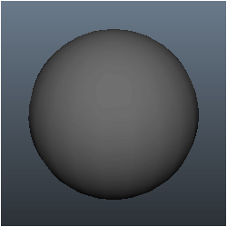
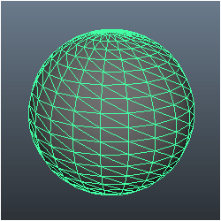
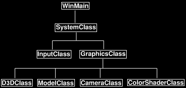
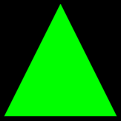

# 教程4：缓冲区、着色器和 HLSL

[原文链接](http://www.rastertek.com/dx11s2tut04.html)

本教程将介绍如何在 DirectX 11 中编写顶点和像素着色器，还将介绍如何在 DirectX 11 中使用顶点和索引缓冲区，这些是渲染 3D 图形时需要理解和利用的最基本概念。

## 顶点缓冲区

首先要理解的概念是顶点缓冲区，为了说明这个概念，让我们以球体的 3D 模型为例：



3D 球体模型实际上由成百上千个三角形组成：



球体模型中的每个三角形都有三个点，我们称每个点为顶点，因此，为了渲染球体模型，我们需要将构成球体的所有顶点放入一个特殊的数据数组中，我们称之为顶点缓冲区；一旦球体模型的所有点都被放置到了顶点缓冲区中，我们就可以将顶点缓冲区发送到 GPU，来将模型渲染出来。

## 索引缓冲区

索引缓冲区与顶点缓冲区相关，它们的目的是记录顶点缓冲区中每个顶点的位置；然后，GPU 使用索引缓冲区快速查找顶点缓冲区中的特定顶点。

索引缓冲区的概念类似于在书中使用目录的概念，它有助于以更高的速度找到您要查找的主题。

DirectX 文档表示，使用索引缓冲区还可以增加将顶点数据缓存到显存中更快位置的可能性。

因此，出于性能方面的考虑，强烈建议使用索引缓冲区。

## 顶点着色器

顶点着色器是一种小程序，主要用于将顶点从顶点缓冲区转换到三维空间，它还可以进行其他计算，例如计算每个顶点的法线。

GPU 将为需要处理的每个顶点调用顶点着色器程序，例如，一个 5000 个多边形组成的模型每帧将运行 15000 次你定义的顶点着色器程序，来绘制这个模型；因此，如果你将图形程序锁定为每秒 60 帧，它将每秒调用 90 万次顶点着色器来绘制 5000 个三角形。

显而易见，编写高效的顶点着色器非常重要。

## 像素着色器

像素着色器是为我们绘制的多边形着色而编写的小程序，它们由 GPU 为屏幕上的每个可见像素运行。

颜色、纹理、光照以及你计划对多边形面的大多数效果设置都由像素着色器程序处理。

由于 GPU 将调用像素着色器的次数，因此必须高效地编写像素着色器。

## HLSL

HLSL 是我们在 DirectX 11 中用来编写这些顶点和像素着色器程序的语言，它的语法与C语言基本相同，只是有一些预定义的类型。

HLSL 程序文件由 全局变量、类型定义、顶点着色器、像素着色器和几何体着色器 组成。

由于这是第一个 HLSL 教程，我们将使用 DirectX 10 开始一个非常简单的 HLSL 程序。

## 更新后的框架



本教程的框架已经更新，在 `GraphicsClass` 下，我们添加了三个新类，分别称为 `CameraClass`、`ModelClass` 和 `ColorShaderClass`。

`CameraClass` 将处理我们之前讨论过的视图矩阵，它将处理相机在世界坐标系下的位置，并在着色器需要绘制并确定我们从何处观看场景时将其传递给着色器。

`ModelClass` 将处理 3D 模型的几何图形，为了简单起见，在本教程中 3D 模型将只是一个三角形。

最后，`ColorShaderClass` 将负责调用 HLSL 着色器将模型渲染到屏幕上。

在本篇教程代码开始之前，让我们先看一下 HLSL 着色器程序。

## Color.vs

这将是我们的第一个着色器程序。

着色器是对模型进行实际渲染的小程序，这些着色器用 HLSL 编写，并存储在名为 color.vs 和 color.ps 的源文件中。另外，我把这些文件和 .cpp 与 .h 文件一起放到了引擎中，请注意，你需要在 VisualStudio 中为它们创建一个新的 过滤器/文件夹。确保右键单击着色器文件并选择“属性”，在弹出窗口中，内容部分中应该没有任何内容，项目类型部分中应该显示“不参与构建”，否则你将收到关于程序主入口点的编译错误。

现在，这个着色器的目的只是绘制彩色三角形，因为我在第一个 HLSL 教程中尽可能地保持简单。以下是顶点着色器的代码：

```hlsl
////////////////////////////////////////////////////////////////////////////////
// Filename: color.vs
////////////////////////////////////////////////////////////////////////////////
```

在着色器程序中，从全局变量开始：这些全局变量可以从外部的 C++ 代码进行修改，你可以使用多种类型的变量，例如 int 或 float，然后在外部设置它们以供着色器程序使用。

通常，你会将大多数全局变量放在名为 `cbuffer` 的缓冲区对象类型中，即使它只是一个全局变量。逻辑地组织这些缓冲区对于着色器的有效执行以及显卡存储缓冲区的方式非常重要。

在本例中，我将三个矩阵放在同一个缓冲区中，因为我将同时更新它们的每一帧。

```hlsl
/////////////
// GLOBALS //
/////////////
cbuffer MatrixBuffer
{
    matrix worldMatrix;
    matrix viewMatrix;
    matrix projectionMatrix;
};
```

与 C 类似，我们可以创建自己的类型定义：我们将使用 HLSL 可用的不同类型，例如 `float4`，这使对着色器的编程更容易和可读。

在本例中，我们将创建具有 `x、y、z、w` 位置向量和 红、绿、蓝、alpha 颜色的类型。`POSITION`、`COLOR` 和 `SV_POSITION` 是向 GPU 传递变量使用的语义。

我必须在这里创建两个不同的结构，因为顶点着色器和像素着色器的语义不同，尽管在其他方面结构相同：`POSITION` 适用于顶点着色器，`SV_POSITION` 适用于像素着色器，而 `COLOR` 适用于两者；如果需要多个相同类型，则必须在末尾添加一个数字，如`COLOR0、COLOR1`等。

```hlsl
//////////////
// TYPEDEFS //
//////////////
struct VertexInputType
{
    float4 position : POSITION;
    float4 color : COLOR;
};

struct PixelInputType
{
    float4 position : SV_POSITION;
    float4 color : COLOR;
};
```

当 GPU 处理来自已发送给它的顶点缓冲区的数据时，会调用顶点着色器,这个我命名为 `ColorVertexShader` 的顶点着色器将为顶点缓冲区中的每个顶点调用。顶点着色器的输入必须与顶点缓冲区中的数据格式以及着色器源文件（在本例中为 `VertexInputType`）中的类型定义相匹配。顶点着色器的输出将被发送到像素着色器。在这种情况下，输出类型被称为 `PixelInputType`，这也是上面定义的。

考虑这一点，你可以看到顶点着色器创建了一个 `PixelInputType` 类型的输出变量。然后获取输入顶点的位置，并将其乘以 世界、视图和投影矩阵，这将根据我们的视角将顶点放置在正确的位置，以便在 3D 空间中进行渲染，然后放置到 2D 屏幕上。

之后，输出变量获取输入颜色的副本，然后返回的输出将用作像素着色器输入。还要注意，我刻意在输入时将 `W` 值设置为 1.0，否则它是未定义的，因为我们只读取位置的 `XYZ` 向量。

```hlsl
////////////////////////////////////////////////////////////////////////////////
// Vertex Shader
////////////////////////////////////////////////////////////////////////////////
PixelInputType ColorVertexShader(VertexInputType input)
{
    PixelInputType output;
    

    // Change the position vector to be 4 units for proper matrix calculations.
    input.position.w = 1.0f;

    // Calculate the position of the vertex against the world, view, and projection matrices.
    output.position = mul(input.position, worldMatrix);
    output.position = mul(output.position, viewMatrix);
    output.position = mul(output.position, projectionMatrix);
    
    // Store the input color for the pixel shader to use.
    output.color = input.color;
    
    return output;
}
```

## Color.ps

像素着色器为渲染到屏幕的多边形上绘制每个像素，在这个像素着色器中，它使用 `PixelInputType` 作为输入，并返回一个 `float4` 作为输出，它代表最终的像素颜色。

这个像素着色器程序非常简单，因为我们只是告诉它将像素的颜色设置为与颜色的输入值相同的颜色，请注意，像素着色器从顶点着色器输出获取其输入。

```hlsl
////////////////////////////////////////////////////////////////////////////////
// Filename: color.ps
////////////////////////////////////////////////////////////////////////////////


//////////////
// TYPEDEFS //
//////////////
struct PixelInputType
{
    float4 position : SV_POSITION;
    float4 color : COLOR;
};


////////////////////////////////////////////////////////////////////////////////
// Pixel Shader
////////////////////////////////////////////////////////////////////////////////
float4 ColorPixelShader(PixelInputType input) : SV_TARGET
{
    return input.color;
}
```

## Colorshaderclass.h

我们将使用 `ColorShaderClass` 调用 HLSL 着色器来绘制 GPU 上的 3D 模型。

```cpp
////////////////////////////////////////////////////////////////////////////////
// Filename: colorshaderclass.h
////////////////////////////////////////////////////////////////////////////////
#ifndef _COLORSHADERCLASS_H_
#define _COLORSHADERCLASS_H_


//////////////
// INCLUDES //
//////////////
#include <d3d11.h>
#include <d3dcompiler.h>
#include <directxmath.h>
#include <fstream>
using namespace DirectX;
using namespace std;


////////////////////////////////////////////////////////////////////////////////
// Class name: ColorShaderClass
////////////////////////////////////////////////////////////////////////////////
class ColorShaderClass
{
private:
```

以下是将与顶点着色器一起使用的 `cBuffer` 类型的定义。

此 `typedef` 必须与顶点着色器中的 `typedef` 完全相同，因为模型数据需要与着色器中的 `typedef` 匹配，才能进行正确渲染。

```cpp
	struct MatrixBufferType
	{
		XMMATRIX world;
		XMMATRIX view;
		XMMATRIX projection;
	};

public:
	ColorShaderClass();
	ColorShaderClass(const ColorShaderClass&);
	~ColorShaderClass();
```

这里的函数处理着色器的初始化和关闭，渲染函数设置着色器参数，然后使用着色器绘制准备好的模型顶点。

```cpp
	bool Initialize(ID3D11Device*, HWND);
	void Shutdown();
	bool Render(ID3D11DeviceContext*, int, XMMATRIX, XMMATRIX, XMMATRIX);

private:
	bool InitializeShader(ID3D11Device*, HWND, WCHAR*, WCHAR*);
	void ShutdownShader();
	void OutputShaderErrorMessage(ID3D10Blob*, HWND, WCHAR*);

	bool SetShaderParameters(ID3D11DeviceContext*, XMMATRIX, XMMATRIX, XMMATRIX);
	void RenderShader(ID3D11DeviceContext*, int);

private:
	ID3D11VertexShader* m_vertexShader;
	ID3D11PixelShader* m_pixelShader;
	ID3D11InputLayout* m_layout;
	ID3D11Buffer* m_matrixBuffer;
};

#endif
```

## Colorshaderclass.cpp

```cpp
////////////////////////////////////////////////////////////////////////////////
// Filename: colorshaderclass.cpp
////////////////////////////////////////////////////////////////////////////////
#include "colorshaderclass.h"
```

像往常一样，类构造函数将类中的所有私有指针初始化为空。

```cpp
ColorShaderClass::ColorShaderClass()
{
	m_vertexShader = 0;
	m_pixelShader = 0;
	m_layout = 0;
	m_matrixBuffer = 0;
}


ColorShaderClass::ColorShaderClass(const ColorShaderClass& other)
{
}


ColorShaderClass::~ColorShaderClass()
{
}
```

`Initialize` 函数将调用着色器的初始化函数，我们传入 HLSL 着色器文件的名称，在本教程中，文件被命名为 color.vs 和 color.ps.

```cpp
bool ColorShaderClass::Initialize(ID3D11Device* device, HWND hwnd)
{
	bool result;


	// Initialize the vertex and pixel shaders.
	result = InitializeShader(device, hwnd, L"../Engine/color.vs", L"../Engine/color.ps");
	if(!result)
	{
		return false;
	}

	return true;
}
```

`Shutdown` 函数将调用着色器的关闭函数。

```cpp
void ColorShaderClass::Shutdown()
{
	// Shutdown the vertex and pixel shaders as well as the related objects.
	ShutdownShader();

	return;
}
```

`Render` 将首先使用 `SetShaderParameters` 函数设置着色器内的参数，设置参数后，它会调用 `RenderShader`，使用HLSL 着色器绘制绿色三角形。

```cpp
bool ColorShaderClass::Render(ID3D11DeviceContext* deviceContext, int indexCount, XMMATRIX worldMatrix, XMMATRIX viewMatrix,
							  XMMATRIX projectionMatrix)
{
	bool result;


	// Set the shader parameters that it will use for rendering.
	result = SetShaderParameters(deviceContext, worldMatrix, viewMatrix, projectionMatrix);
	if(!result)
	{
		return false;
	}

	// Now render the prepared buffers with the shader.
	RenderShader(deviceContext, indexCount);

	return true;
}
```

现在，我们将从本教程中一个更重要的函数开始，它叫做 `InitializeShader`，该函数实际加载着色器文件，并使其可用于 DirectX 和 GPU。

您还将看到布局的设置，以及顶点缓冲区数据在 GPU 图形管道上的外观，布局需要与 modelclass.h 中的 `VertexType` 和 color.vs 中的定义匹配。

```cpp
bool ColorShaderClass::InitializeShader(ID3D11Device* device, HWND hwnd, WCHAR* vsFilename, WCHAR* psFilename)
{
	HRESULT result;
	ID3D10Blob* errorMessage;
	ID3D10Blob* vertexShaderBuffer;
	ID3D10Blob* pixelShaderBuffer;
	D3D11_INPUT_ELEMENT_DESC polygonLayout[2];
	unsigned int numElements;
	D3D11_BUFFER_DESC matrixBufferDesc;


	// Initialize the pointers this function will use to null.
	errorMessage = 0;
	vertexShaderBuffer = 0;
	pixelShaderBuffer = 0;
```

这里是我们将着色器程序编译到缓冲区的地方，我们给出了 着色器文件的名称、着色器的名称、着色器版本（DirectX 11 中是 5.0）以及编译着色器的缓冲区；如果编译着色器失败，它将在 `errorMessage` 字符串中存入一条错误消息，我们将其发送给另一个函数以输出错误；如果它仍然失败，并且没有错误消息字符串，则意味着它无法找到着色器文件，在这种情况下，我们会弹出一个对话框说明原因。

```cpp
	// Compile the vertex shader code.
	result = D3DCompileFromFile(vsFilename, NULL, NULL, "ColorVertexShader", "vs_5_0", D3D10_SHADER_ENABLE_STRICTNESS, 0,
				    &vertexShaderBuffer, &errorMessage);
	if(FAILED(result))
	{
		// If the shader failed to compile it should have writen something to the error message.
		if(errorMessage)
		{
			OutputShaderErrorMessage(errorMessage, hwnd, vsFilename);
		}
		// If there was  nothing in the error message then it simply could not find the shader file itself.
		else
		{
			MessageBox(hwnd, vsFilename, L"Missing Shader File", MB_OK);
		}

		return false;
	}

	// Compile the pixel shader code.
	result = D3DCompileFromFile(psFilename, NULL, NULL, "ColorPixelShader", "ps_5_0", D3D10_SHADER_ENABLE_STRICTNESS, 0,
				    &pixelShaderBuffer, &errorMessage);
	if(FAILED(result))
	{
		// If the shader failed to compile it should have writen something to the error message.
		if(errorMessage)
		{
			OutputShaderErrorMessage(errorMessage, hwnd, psFilename);
		}
		// If there was nothing in the error message then it simply could not find the file itself.
		else
		{
			MessageBox(hwnd, psFilename, L"Missing Shader File", MB_OK);
		}

		return false;
	}
```

一旦顶点着色器和像素着色器代码成功编译进缓冲区，我们就可以使用这些缓冲区来创建着色器对象本身，从这一点开始，我们将使用这些指针来与顶点和像素着色器通信。

```cpp
	// Create the vertex shader from the buffer.
	result = device->CreateVertexShader(vertexShaderBuffer->GetBufferPointer(), vertexShaderBuffer->GetBufferSize(), NULL, &m_vertexShader);
	if(FAILED(result))
	{
		return false;
	}

	// Create the pixel shader from the buffer.
	result = device->CreatePixelShader(pixelShaderBuffer->GetBufferPointer(), pixelShaderBuffer->GetBufferSize(), NULL, &m_pixelShader);
	if(FAILED(result))
	{
		return false;
	}
```

下一步是创建将由着色器处理的顶点数据的布局。

由于该着色器使用位置和颜色向量，我们需要在布局中创建这两个向量，并指定这两个向量的大小。

语义名称是布局中首先要填写的内容，这允许着色器确定布局中该元素的用法：因为我们有两种不同的元素，所以第一种元素命名为 `POSITION`，第二种元素命名为 `COLOR`。

布局的下一个重要部分是格式，对于位置向量，我们使用 `DXGI_FORMAT_R32G32B32_FLOAT`；对于颜色，我们使用 `DXGI_FORMAT_R32G32B32A32_FLOAT`。

最后需要注意的是 `AlignedByteOffset`，它指示数据在缓冲区中的间距：对于这个布局，我们告诉它前 12 个字节是位置，接下来 16 个字节是颜色，`AlignedByteOffset` 用于标注每个元素的开始位置。你可以使用 `D3D11_APPEND_ALIGNED_ELEMENT`，而不是自定义的值放在 `AlignedByteOffset` 中，它会为你计算出间距。

由于本教程中不需要其他设置，所以我现在将其设置为默认值。

```cpp
	// Create the vertex input layout description.
	// This setup needs to match the VertexType stucture in the ModelClass and in the shader.
	polygonLayout[0].SemanticName = "POSITION";
	polygonLayout[0].SemanticIndex = 0;
	polygonLayout[0].Format = DXGI_FORMAT_R32G32B32_FLOAT;
	polygonLayout[0].InputSlot = 0;
	polygonLayout[0].AlignedByteOffset = 0;
	polygonLayout[0].InputSlotClass = D3D11_INPUT_PER_VERTEX_DATA;
	polygonLayout[0].InstanceDataStepRate = 0;

	polygonLayout[1].SemanticName = "COLOR";
	polygonLayout[1].SemanticIndex = 0;
	polygonLayout[1].Format = DXGI_FORMAT_R32G32B32A32_FLOAT;
	polygonLayout[1].InputSlot = 0;
	polygonLayout[1].AlignedByteOffset = D3D11_APPEND_ALIGNED_ELEMENT;
	polygonLayout[1].InputSlotClass = D3D11_INPUT_PER_VERTEX_DATA;
	polygonLayout[1].InstanceDataStepRate = 0;
```

一旦布局描述被设置好，我们可以得到它的大小，然后使用 D3D 设备创建输入布局，此外，还可以释放顶点和像素着色器缓冲区，因为一旦创建布局，就不再需要它们。

```cpp
	// Get a count of the elements in the layout.
	numElements = sizeof(polygonLayout) / sizeof(polygonLayout[0]);

	// Create the vertex input layout.
	result = device->CreateInputLayout(polygonLayout, numElements, vertexShaderBuffer->GetBufferPointer(), 
					   vertexShaderBuffer->GetBufferSize(), &m_layout);
	if(FAILED(result))
	{
		return false;
	}

	// Release the vertex shader buffer and pixel shader buffer since they are no longer needed.
	vertexShaderBuffer->Release();
	vertexShaderBuffer = 0;

	pixelShaderBuffer->Release();
	pixelShaderBuffer = 0;
```

使用着色器需要设置的最后一件事是常量缓冲区，正如你在顶点着色器中看到的，我们目前只有一个常量缓冲区，所以我们只需要在这里设置一个，这样我们就可以与着色器交互。

缓冲区用法需要设置为动态，因为我们将在每一帧更新它。

绑定标志指示此缓冲区将是一个常量缓冲区。

CPU 访问标志需要与使用情况相匹配，因此设置为 `D3D11_CPU_ACCESS_WRITE`。

填写描述后，我们可以创建常量缓冲区接口，然后使用函数 `SetShaderParameters` 访问着色器中的内部变量。

```cpp
	// Setup the description of the dynamic matrix constant buffer that is in the vertex shader.
	matrixBufferDesc.Usage = D3D11_USAGE_DYNAMIC;
	matrixBufferDesc.ByteWidth = sizeof(MatrixBufferType);
	matrixBufferDesc.BindFlags = D3D11_BIND_CONSTANT_BUFFER;
	matrixBufferDesc.CPUAccessFlags = D3D11_CPU_ACCESS_WRITE;
	matrixBufferDesc.MiscFlags = 0;
	matrixBufferDesc.StructureByteStride = 0;

	// Create the constant buffer pointer so we can access the vertex shader constant buffer from within this class.
	result = device->CreateBuffer(&matrixBufferDesc, NULL, &m_matrixBuffer);
	if(FAILED(result))
	{
		return false;
	}

	return true;
}
```

`ShutdowShader` 释放在 `InitializeShader` 函数中设置的四个接口。

```cpp
void ColorShaderClass::ShutdownShader()
{
	// Release the matrix constant buffer.
	if(m_matrixBuffer)
	{
		m_matrixBuffer->Release();
		m_matrixBuffer = 0;
	}

	// Release the layout.
	if(m_layout)
	{
		m_layout->Release();
		m_layout = 0;
	}

	// Release the pixel shader.
	if(m_pixelShader)
	{
		m_pixelShader->Release();
		m_pixelShader = 0;
	}

	// Release the vertex shader.
	if(m_vertexShader)
	{
		m_vertexShader->Release();
		m_vertexShader = 0;
	}

	return;
}
```

`OutputShaderErrorMessage` 输出编译顶点着色器或像素着色器时生成的错误消息。

```cpp
void ColorShaderClass::OutputShaderErrorMessage(ID3D10Blob* errorMessage, HWND hwnd, WCHAR* shaderFilename)
{
	char* compileErrors;
	unsigned long long bufferSize, i;
	ofstream fout;


	// Get a pointer to the error message text buffer.
	compileErrors = (char*)(errorMessage->GetBufferPointer());

	// Get the length of the message.
	bufferSize = errorMessage->GetBufferSize();

	// Open a file to write the error message to.
	fout.open("shader-error.txt");

	// Write out the error message.
	for(i=0; i<bufferSize; i++)
	{
		fout << compileErrors[i];
	}

	// Close the file.
	fout.close();

	// Release the error message.
	errorMessage->Release();
	errorMessage = 0;

	// Pop a message up on the screen to notify the user to check the text file for compile errors.
	MessageBox(hwnd, L"Error compiling shader.  Check shader-error.txt for message.", shaderFilename, MB_OK);

	return;
}
```

`SetShaderVariables` 函数的存在使在着色器中设置全局变量变得更容易，该函数中使用的矩阵是在 `GraphicsClass` 中创建的，在 `Render` 函数调用期间将它们从这里发送到顶点着色器。

```cpp
bool ColorShaderClass::SetShaderParameters(ID3D11DeviceContext* deviceContext, XMMATRIX worldMatrix, XMMATRIX viewMatrix,
					   XMMATRIX projectionMatrix)
{
	HRESULT result;
	D3D11_MAPPED_SUBRESOURCE mappedResource;
	MatrixBufferType* dataPtr;
	unsigned int bufferNumber;
```

确保在将矩阵发送到着色器之前对其进行转置，这是 DirectX 11 的要求。

```cpp
	// Transpose the matrices to prepare them for the shader.
	worldMatrix = XMMatrixTranspose(worldMatrix);
	viewMatrix = XMMatrixTranspose(viewMatrix);
	projectionMatrix = XMMatrixTranspose(projectionMatrix);
```

锁定 `m_matrixBuffer`，在其中设置新矩阵，然后解锁。

```cpp
	// Lock the constant buffer so it can be written to.
	result = deviceContext->Map(m_matrixBuffer, 0, D3D11_MAP_WRITE_DISCARD, 0, &mappedResource);
	if(FAILED(result))
	{
		return false;
	}

	// Get a pointer to the data in the constant buffer.
	dataPtr = (MatrixBufferType*)mappedResource.pData;

	// Copy the matrices into the constant buffer.
	dataPtr->world = worldMatrix;
	dataPtr->view = viewMatrix;
	dataPtr->projection = projectionMatrix;

	// Unlock the constant buffer.
	deviceContext->Unmap(m_matrixBuffer, 0);
```

现在在 HLSL 顶点着色器中设置更新后的矩阵缓冲区。

```cpp
	// Set the position of the constant buffer in the vertex shader.
	bufferNumber = 0;

	// Finanly set the constant buffer in the vertex shader with the updated values.
	deviceContext->VSSetConstantBuffers(bufferNumber, 1, &m_matrixBuffer);

	return true;
}
```

`RenderShader` 是在 `Render` 函数中调用的第二个函数，在此之前调用 `SetShaderParameters`，以确保着色器参数设置正确。

此函数的第一步是在输入装配器中将我们的输入布局设置为活动，这可以让 GPU 知晓顶点缓冲区中数据的格式。

第二步是设置我们将用于渲染该顶点缓冲区的顶点着色器和像素着色器，设置着色器后，我们使用 D3D 设备上下文调用 `DrawIndexed` 这个 DirectX 11 函数来渲染三角形，调用此函数后，绿色的三角形就被渲染出来了。

```cpp
void ColorShaderClass::RenderShader(ID3D11DeviceContext* deviceContext, int indexCount)
{
	// Set the vertex input layout.
	deviceContext->IASetInputLayout(m_layout);

	// Set the vertex and pixel shaders that will be used to render this triangle.
	deviceContext->VSSetShader(m_vertexShader, NULL, 0);
	deviceContext->PSSetShader(m_pixelShader, NULL, 0);

	// Render the triangle.
	deviceContext->DrawIndexed(indexCount, 0, 0);

	return;
}
```

## Modelclass.h

如前所述，`ModelClass` 负责封装3D模型的几何体。

在本教程中，我们将手动设置单个绿色三角形的数据，我们还将为三角形创建顶点和索引缓冲区，以便可以对其进行渲染。

```cpp
////////////////////////////////////////////////////////////////////////////////
// Filename: modelclass.h
////////////////////////////////////////////////////////////////////////////////
#ifndef _MODELCLASS_H_
#define _MODELCLASS_H_


//////////////
// INCLUDES //
//////////////
#include <d3d11.h>
#include <directxmath.h>
using namespace DirectX;


////////////////////////////////////////////////////////////////////////////////
// Class name: ModelClass
////////////////////////////////////////////////////////////////////////////////
class ModelClass
{
private:
```

下面是我们的顶点类型的定义，它将与这个 `ModelClass` 中的顶点缓冲区一起使用，还需要注意的是，这个类型定义必须与 `ColorShaderClass` 中的布局相匹配，这将在本教程后面介绍。

```cpp
	struct VertexType
	{
		XMFLOAT3 position;
		XMFLOAT4 color;
	};

public:
	ModelClass();
	ModelClass(const ModelClass&);
	~ModelClass();
```

这里的函数用于处理初始化和关闭模型的顶点和索引缓冲区，`Render` 函数将模型几何体放置在显卡上，以准备由色彩着色器绘制。

```cpp
	bool Initialize(ID3D11Device*);
	void Shutdown();
	void Render(ID3D11DeviceContext*);

	int GetIndexCount();

private:
	bool InitializeBuffers(ID3D11Device*);
	void ShutdownBuffers();
	void RenderBuffers(ID3D11DeviceContext*);
```

`ModelClass` 中的私有变量是顶点和索引缓冲区以及两个整数，这两个整数用于跟踪每个缓冲区的大小。

请注意，所有 DirectX 11 缓冲区通常使用通用 `ID3D11Buffer` 类型，并且在第一次创建时通过缓冲区描述更清楚地标识。

```cpp
private:
	ID3D11Buffer *m_vertexBuffer, *m_indexBuffer;
	int m_vertexCount, m_indexCount;
};

#endif
```

## Modelclass.cpp

```cpp
////////////////////////////////////////////////////////////////////////////////
// Filename: modelclass.cpp
////////////////////////////////////////////////////////////////////////////////
#include "modelclass.h"
```

类构造函数将顶点和索引缓冲区指针初始化为空。

```cpp
ModelClass::ModelClass()
{
	m_vertexBuffer = 0;
	m_indexBuffer = 0;
}


ModelClass::ModelClass(const ModelClass& other)
{
}


ModelClass::~ModelClass()
{
}
```

`Initialize` 函数将调用顶点和索引缓冲区的初始化函数。

```cpp
bool ModelClass::Initialize(ID3D11Device* device)
{
	bool result;


	// Initialize the vertex and index buffers.
	result = InitializeBuffers(device);
	if(!result)
	{
		return false;
	}

	return true;
}
```

`Shutdown` 函数将调用顶点和索引缓冲区的关闭函数。

```cpp
void ModelClass::Shutdown()
{
	// Shutdown the vertex and index buffers.
	ShutdownBuffers();

	return;
}
```

`Render` 函数被 `GraphicsClass:Render` 函数调用，此函数调用 `RenderBuffers` 将顶点和索引缓冲区放置在图形管道上，以便色彩着色器能够渲染它们。

```cpp
void ModelClass::Render(ID3D11DeviceContext* deviceContext)
{
	// Put the vertex and index buffers on the graphics pipeline to prepare them for drawing.
	RenderBuffers(deviceContext);

	return;
}
```

`GetIndexCount` 返回模型中的索引数，色彩着色器将需要此信息来绘制此模型。

```cpp
int ModelClass::GetIndexCount()
{
	return m_indexCount;
}
```

`InitializeBuffers` 函数是我们创建顶点和索引缓冲区的地方，通常，你会读入一个模型，并从该数据文件中创建缓冲区；在本教程中，我们将手动设置顶点和索引缓冲区中的点，因为它仅仅是一个三角形。

```cpp
bool ModelClass::InitializeBuffers(ID3D11Device* device)
{
	VertexType* vertices;
	unsigned long* indices;
	D3D11_BUFFER_DESC vertexBufferDesc, indexBufferDesc;
	D3D11_SUBRESOURCE_DATA vertexData, indexData;
	HRESULT result;
```

首先创建两个临时数组来保存顶点和索引数据，稍后我们将使用它们填充最终的缓冲区。

```cpp
	// Set the number of vertices in the vertex array.
	m_vertexCount = 3;

	// Set the number of indices in the index array.
	m_indexCount = 3;

	// Create the vertex array.
	vertices = new VertexType[m_vertexCount];
	if(!vertices)
	{
		return false;
	}

	// Create the index array.
	indices = new unsigned long[m_indexCount];
	if(!indices)
	{
		return false;
	}
```

现在用三角形的三个点以及每个点的索引填充顶点和索引数组，请注意，我按顺时针顺序创建点，如果逆时针进行此操作，D3D 就会认为三角形朝向相反的方向，并且因为背面剔除而不会绘制三角形。始终记住，将顶点发送到GPU的顺序非常重要。

颜色也在此处设置，因为它是顶点描述的一部分，在这里我把颜色设置为绿色。

```cpp
	// Load the vertex array with data.
	vertices[0].position = XMFLOAT3(-1.0f, -1.0f, 0.0f);  // Bottom left.
	vertices[0].color = XMFLOAT4(0.0f, 1.0f, 0.0f, 1.0f);

	vertices[1].position = XMFLOAT3(0.0f, 1.0f, 0.0f);  // Top middle.
	vertices[1].color = XMFLOAT4(0.0f, 1.0f, 0.0f, 1.0f);

	vertices[2].position = XMFLOAT3(1.0f, -1.0f, 0.0f);  // Bottom right.
	vertices[2].color = XMFLOAT4(0.0f, 1.0f, 0.0f, 1.0f);

	// Load the index array with data.
	indices[0] = 0;  // Bottom left.
	indices[1] = 1;  // Top middle.
	indices[2] = 2;  // Bottom right.
```

填写完顶点数组和索引数组后，我们现在可以使用它们来创建顶点缓冲区和索引缓冲区，创建两个缓冲区的方式相同：

首先填写缓冲区的描述，在描述中，`ByteWidth`（缓冲区大小）和 `BindFlags`（缓冲区类型）是你需要确保正确填写的内容。

填写描述后，还需要填写一个子资源指针，该指针将指向先前创建的顶点或索引数组。

使用描述和子资源指针，你可以使用 D3D 设备调用 `CreateBuffer`，它将返回指向新缓冲区的指针。

```cpp
	// Set up the description of the static vertex buffer.
	vertexBufferDesc.Usage = D3D11_USAGE_DEFAULT;
	vertexBufferDesc.ByteWidth = sizeof(VertexType) * m_vertexCount;
	vertexBufferDesc.BindFlags = D3D11_BIND_VERTEX_BUFFER;
	vertexBufferDesc.CPUAccessFlags = 0;
	vertexBufferDesc.MiscFlags = 0;
	vertexBufferDesc.StructureByteStride = 0;

	// Give the subresource structure a pointer to the vertex data.
	vertexData.pSysMem = vertices;
	vertexData.SysMemPitch = 0;
	vertexData.SysMemSlicePitch = 0;

	// Now create the vertex buffer.
	result = device->CreateBuffer(&vertexBufferDesc, &vertexData, &m_vertexBuffer);
	if(FAILED(result))
	{
		return false;
	}

	// Set up the description of the static index buffer.
	indexBufferDesc.Usage = D3D11_USAGE_DEFAULT;
	indexBufferDesc.ByteWidth = sizeof(unsigned long) * m_indexCount;
	indexBufferDesc.BindFlags = D3D11_BIND_INDEX_BUFFER;
	indexBufferDesc.CPUAccessFlags = 0;
	indexBufferDesc.MiscFlags = 0;
	indexBufferDesc.StructureByteStride = 0;

	// Give the subresource structure a pointer to the index data.
	indexData.pSysMem = indices;
	indexData.SysMemPitch = 0;
	indexData.SysMemSlicePitch = 0;

	// Create the index buffer.
	result = device->CreateBuffer(&indexBufferDesc, &indexData, &m_indexBuffer);
	if(FAILED(result))
	{
		return false;
	}
```

创建顶点缓冲区和索引缓冲区后，可以删除顶点和索引数组，因为数据复制到缓冲区后便不再需要它们。

```cpp
	// Release the arrays now that the vertex and index buffers have been created and loaded.
	delete [] vertices;
	vertices = 0;

	delete [] indices;
	indices = 0;

	return true;
}
```

`ShutdownBuffers` 函数只是释放 `InitializeBuffers` 函数中创建的顶点缓冲区和索引缓冲区。

```cpp
void ModelClass::ShutdownBuffers()
{
	// Release the index buffer.
	if(m_indexBuffer)
	{
		m_indexBuffer->Release();
		m_indexBuffer = 0;
	}

	// Release the vertex buffer.
	if(m_vertexBuffer)
	{
		m_vertexBuffer->Release();
		m_vertexBuffer = 0;
	}

	return;
}
```

`RenderBuffers` 是从 `Render` 函数调用的，此函数的目的是在 GPU 的输入装配器上将顶点缓冲区和索引缓冲区设置为活动，一旦 GPU 有一个活动的顶点缓冲区，它就可以使用着色器渲染该缓冲区。

该函数还定义了如何绘制这些缓冲区，例如三角形、直线、扇形等。

在本教程中，我们在输入装配器上将顶点缓冲区和索引缓冲区设置为活动状态，并告诉 GPU 应该使用 `IASetPrimitiveTopology` 这个 DirectX 函数将缓冲区绘制为三角形。

```cpp
void ModelClass::RenderBuffers(ID3D11DeviceContext* deviceContext)
{
	unsigned int stride;
	unsigned int offset;


	// Set vertex buffer stride and offset.
	stride = sizeof(VertexType); 
	offset = 0;
    
	// Set the vertex buffer to active in the input assembler so it can be rendered.
	deviceContext->IASetVertexBuffers(0, 1, &m_vertexBuffer, &stride, &offset);

	// Set the index buffer to active in the input assembler so it can be rendered.
	deviceContext->IASetIndexBuffer(m_indexBuffer, DXGI_FORMAT_R32_UINT, 0);

	// Set the type of primitive that should be rendered from this vertex buffer, in this case triangles.
	deviceContext->IASetPrimitiveTopology(D3D11_PRIMITIVE_TOPOLOGY_TRIANGLELIST);

	return;
}
```

## Cameraclass.h

我们已经研究了如何编写 HLSL 着色器，如何设置顶点和索引缓冲区，以及如何使用 `ColorShaderClass` 调用 HLSL 着色器来绘制这些缓冲区。然而，我们还没有做的事情是：我们要从何处观察来绘制他们。

为此，我们需要一个摄像机类来让 DirectX 11 知道我们在哪里以及如何观看场景，摄像机类将跟踪相机的位置及其当前旋转，它将使用位置和旋转信息生成视图矩阵，该矩阵将被传递到 HLSL 着色器进行渲染。

```cpp
////////////////////////////////////////////////////////////////////////////////
// Filename: cameraclass.h
////////////////////////////////////////////////////////////////////////////////
#ifndef _CAMERACLASS_H_
#define _CAMERACLASS_H_


//////////////
// INCLUDES //
//////////////
#include <directxmath.h>
using namespace DirectX;


////////////////////////////////////////////////////////////////////////////////
// Class name: CameraClass
////////////////////////////////////////////////////////////////////////////////
class CameraClass
{
public:
	CameraClass();
	CameraClass(const CameraClass&);
	~CameraClass();

	void SetPosition(float, float, float);
	void SetRotation(float, float, float);

	XMFLOAT3 GetPosition();
	XMFLOAT3 GetRotation();

	void Render();
	void GetViewMatrix(XMMATRIX&);

private:
	float m_positionX, m_positionY, m_positionZ;
	float m_rotationX, m_rotationY, m_rotationZ;
	XMMATRIX m_viewMatrix;
};

#endif
```

`CameraClass` 头文件非常简单，只需使用四个函数：`SetPosition` 和 `SetRotation` 功能将用于设置相机对象的位置和旋转；`Render` 将用于基于相机的位置和旋转创建视图矩阵；最后，`GetViewMatrix` 将用于从摄影机对象检索视图矩阵，以便着色器可以使用它进行渲染。

## Cameraclass.cpp

```cpp
////////////////////////////////////////////////////////////////////////////////
// Filename: cameraclass.cpp
////////////////////////////////////////////////////////////////////////////////
#include "cameraclass.h"
```

类构造函数将初始化相机在场景原点的位置和旋转。

```cpp
CameraClass::CameraClass()
{
	m_positionX = 0.0f;
	m_positionY = 0.0f;
	m_positionZ = 0.0f;

	m_rotationX = 0.0f;
	m_rotationY = 0.0f;
	m_rotationZ = 0.0f;
}


CameraClass::CameraClass(const CameraClass& other)
{
}


CameraClass::~CameraClass()
{
}
```

`SetPosition` 和 `SetRotation` 函数用于设置摄像机的位置和旋转量。

```cpp
void CameraClass::SetPosition(float x, float y, float z)
{
	m_positionX = x;
	m_positionY = y;
	m_positionZ = z;
	return;
}


void CameraClass::SetRotation(float x, float y, float z)
{
	m_rotationX = x;
	m_rotationY = y;
	m_rotationZ = z;
	return;
}
```

`GetPosition` 和 `GetRotation` 函数将相机的位置和旋转量返回给调用函数。

```cpp
XMFLOAT3 CameraClass::GetPosition()
{
	return XMFLOAT3(m_positionX, m_positionY, m_positionZ);
}


XMFLOAT3 CameraClass::GetRotation()
{
	return XMFLOAT3(m_rotationX, m_rotationY, m_rotationZ);
}
```

`Render` 函数使用相机的位置和旋转量来构建和更新视图矩阵。

我们首先设置向上、位置、旋转等变量，然后在场景的原点，我们根据相机的 x、y和z 旋转来旋转相机。

一旦它正确旋转，我们就可以将相机平移到三维空间中的位置。

在 `position`、`lookAt` 和 向上向量 中输入正确的值后，我们可以使用 `XMMatrixLookAtLH` 函数创建视图矩阵，以表示当前相机的旋转和平移。

```cpp
void CameraClass::Render()
{
	XMFLOAT3 up, position, lookAt;
	XMVECTOR upVector, positionVector, lookAtVector;
	float yaw, pitch, roll;
	XMMATRIX rotationMatrix;


	// Setup the vector that points upwards.
	up.x = 0.0f;
	up.y = 1.0f;
	up.z = 0.0f;

	// Load it into a XMVECTOR structure.
	upVector = XMLoadFloat3(&up);

	// Setup the position of the camera in the world.
	position.x = m_positionX;
	position.y = m_positionY;
	position.z = m_positionZ;

	// Load it into a XMVECTOR structure.
	positionVector = XMLoadFloat3(&position);

	// Setup where the camera is looking by default.
	lookAt.x = 0.0f;
	lookAt.y = 0.0f;
	lookAt.z = 1.0f;

	// Load it into a XMVECTOR structure.
	lookAtVector = XMLoadFloat3(&lookAt);

	// Set the yaw (Y axis), pitch (X axis), and roll (Z axis) rotations in radians.
	pitch = m_rotationX * 0.0174532925f;
	yaw   = m_rotationY * 0.0174532925f;
	roll  = m_rotationZ * 0.0174532925f;

	// Create the rotation matrix from the yaw, pitch, and roll values.
	rotationMatrix = XMMatrixRotationRollPitchYaw(pitch, yaw, roll);

	// Transform the lookAt and up vector by the rotation matrix so the view is correctly rotated at the origin.
	lookAtVector = XMVector3TransformCoord(lookAtVector, rotationMatrix);
	upVector = XMVector3TransformCoord(upVector, rotationMatrix);

	// Translate the rotated camera position to the location of the viewer.
	lookAtVector = XMVectorAdd(positionVector, lookAtVector);

	// Finally create the view matrix from the three updated vectors.
	m_viewMatrix = XMMatrixLookAtLH(positionVector, lookAtVector, upVector);

	return;
}
```

调用 `Render` 函数创建视图矩阵后，我们可以使用 `GetViewMatrix` 函数向调用函数提供更新后的视图矩阵，视图矩阵将是 HLSL 顶点着色器中使用的三个主要矩阵之一。

```cpp
void CameraClass::GetViewMatrix(XMMATRIX& viewMatrix)
{
	viewMatrix = m_viewMatrix;
	return;
}
```

## Graphicsclass.h

`GraphicsClass` 现在添加了三个新类：`CameraClass`、`ModelClass` 和 `ColorShaderClass` 在这里添加了头文件以及私有成员变量。

请记住，`GraphicsClass` 是通过调用项目所需的所有类对象来渲染场景的主类。

```cpp
////////////////////////////////////////////////////////////////////////////////
// Filename: graphicsclass.h
////////////////////////////////////////////////////////////////////////////////
#ifndef _GRAPHICSCLASS_H_
#define _GRAPHICSCLASS_H_


///////////////////////
// MY CLASS INCLUDES //
///////////////////////
#include "d3dclass.h"
#include "cameraclass.h"
#include "modelclass.h"
#include "colorshaderclass.h"


/////////////
// GLOBALS //
/////////////
const bool FULL_SCREEN = false;
const bool VSYNC_ENABLED = true;
const float SCREEN_DEPTH = 1000.0f;
const float SCREEN_NEAR = 0.1f;


////////////////////////////////////////////////////////////////////////////////
// Class name: GraphicsClass
////////////////////////////////////////////////////////////////////////////////
class GraphicsClass
{
public:
	GraphicsClass();
	GraphicsClass(const GraphicsClass&);
	~GraphicsClass();

	bool Initialize(int, int, HWND);
	void Shutdown();
	bool Frame();

private:
	bool Render();

private:
	D3DClass* m_Direct3D;
	CameraClass* m_Camera;
	ModelClass* m_Model;
	ColorShaderClass* m_ColorShader;
};

#endif
```

## Graphicsclass.cpp

```cpp
////////////////////////////////////////////////////////////////////////////////
// Filename: graphicsclass.cpp
////////////////////////////////////////////////////////////////////////////////
#include "graphicsclass.h"
```

`GraphicsClass` 的第一个更改是将类构造函数中的 摄影机、模型和颜色着色器对象 初始化为空。

```cpp
GraphicsClass::GraphicsClass()
{
	m_Direct3D = 0;
	m_Camera = 0;
	m_Model = 0;
	m_ColorShader = 0;
}


GraphicsClass::GraphicsClass(const GraphicsClass& other)
{
}


GraphicsClass::~GraphicsClass()
{
}
```

`Initialize` 函数也已更新，以创建和初始化三个新对象。

```cpp
bool GraphicsClass::Initialize(int screenWidth, int screenHeight, HWND hwnd)
{
	bool result;


	// Create the Direct3D object.
	m_Direct3D = new D3DClass;
	if(!m_Direct3D)
	{
		return false;
	}

	// Initialize the Direct3D object.
	result = m_Direct3D->Initialize(screenWidth, screenHeight, VSYNC_ENABLED, hwnd, FULL_SCREEN, SCREEN_DEPTH, SCREEN_NEAR);
	if(!result)
	{
		MessageBox(hwnd, L"Could not initialize Direct3D.", L"Error", MB_OK);
		return false;
	}

	// Create the camera object.
	m_Camera = new CameraClass;
	if (!m_Camera)
	{
		return false;
	}

	// Set the initial position of the camera.
	m_Camera->SetPosition(0.0f, 0.0f, -5.0f);

	// Create the model object.
	m_Model = new ModelClass;
	if (!m_Model)
	{
		return false;
	}

	// Initialize the model object.
	result = m_Model->Initialize(m_Direct3D->GetDevice());
	if (!result)
	{
		MessageBox(hwnd, L"Could not initialize the model object.", L"Error", MB_OK);
		return false;
	}

	// Create the color shader object.
	m_ColorShader = new ColorShaderClass;
	if (!m_ColorShader)
	{
		return false;
	}

	// Initialize the color shader object.
	result = m_ColorShader->Initialize(m_Direct3D->GetDevice(), hwnd);
	if (!result)
	{
		MessageBox(hwnd, L"Could not initialize the color shader object.", L"Error", MB_OK);
		return false;
	}

	return true;
}
```

`Shutdown` 函数也会更新来关闭并释放这三个新对象。

```cpp
void GraphicsClass::Shutdown()
{
	// Release the color shader object.
	if (m_ColorShader)
	{
		m_ColorShader->Shutdown();
		delete m_ColorShader;
		m_ColorShader = 0;
	}

	// Release the model object.
	if (m_Model)
	{
		m_Model->Shutdown();
		delete m_Model;
		m_Model = 0;
	}

	// Release the camera object.
	if (m_Camera)
	{
		delete m_Camera;
		m_Camera = 0;
	}

	// Release the D3D object.
	if(m_Direct3D)
	{
		m_Direct3D->Shutdown();
		delete m_Direct3D;
		m_Direct3D = 0;
	}

	return;
}
```

`Frame` 函数与先前的教程保持一致。

```cpp
bool GraphicsClass::Frame()
{
	bool result;


	// Render the graphics scene.
	result = Render();
	if(!result)
	{
		return false;
	}

	return true;
}
```

正如你所料，我们对于 `Render` 函数的更改最多。

它仍然从清空场景开始，并且只是清空为黑色。

之后，它会调用摄影机对象的 `Render` 函数，以根据在初始化函数中设置的摄影机位置创建视图矩阵。

创建视图矩阵后，我们将从摄像机类中获取它的副本，我们还从 `D3DClass` 对象获取 世界和投影矩阵 的副本。

然后我们调用 `ModelClass:Render` 函数，将绿色三角形模型几何体放到图形管线上。

现在准备好顶点后，我们调用颜色着色器，使用模型信息和用于定位每个顶点的三个矩阵绘制顶点，绿色三角形现在就被绘制到后缓冲区了。

这样，场景绘制完成后，我们调用 `EndScene` 将其显示在屏幕上。

```cpp
bool GraphicsClass::Render()
{
	XMMATRIX worldMatrix, viewMatrix, projectionMatrix;
	bool result;


	// Clear the buffers to begin the scene.
	m_Direct3D->BeginScene(0.0f, 0.0f, 0.0f, 1.0f);

	// Generate the view matrix based on the camera's position.
	m_Camera->Render();

	// Get the world, view, and projection matrices from the camera and d3d objects.
	m_Direct3D->GetWorldMatrix(worldMatrix);
	m_Camera->GetViewMatrix(viewMatrix);
	m_Direct3D->GetProjectionMatrix(projectionMatrix);

	// Put the model vertex and index buffers on the graphics pipeline to prepare them for drawing.
	m_Model->Render(m_Direct3D->GetDeviceContext());

	// Render the model using the color shader.
	result = m_ColorShader->Render(m_Direct3D->GetDeviceContext(), m_Model->GetIndexCount(), worldMatrix, viewMatrix, projectionMatrix);
	if (!result)
	{
		return false;
	}

	// Present the rendered scene to the screen.
	m_Direct3D->EndScene();

	return true;
}
```

## 总结

总之，你应该已经了解了顶点和索引缓冲区的工作原理，你还应该了解顶点和像素着色器的基本知识，以及如何使用 HLSL 编写它们；最后，你应该了解我们是如何将这些新概念融入到我们的框架中，从而产生一个绿色三角形，呈现在屏幕上。

我还想提到的是，我意识到仅仅画一个三角形的代码就相当长，而且都挤在 `main()` 函数中；然而，我这样做是为了搭建一个合适的框架，所以接下来的教程只需要对代码进行很少的修改就可以完成更复杂的图形。



## 练习

1. 编译并运行教程，确保它在屏幕上绘制一个绿色三角形，按 escape 键退出。

2. 将三角形的颜色更改为红色。

3. 把三角形变成正方形。

4. 将相机向后移动 10 个单位。

5. 更改像素着色器以输出亮度减半的颜色。（重要提示：将 `ColorPixelShader` 中的某些内容乘以 0.5f）