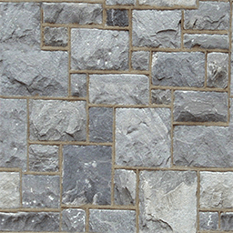
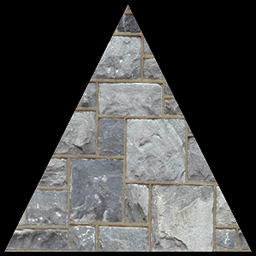
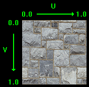
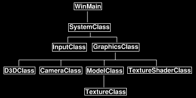

# 教程5：纹理贴图

[原文链接](http://www.rastertek.com/dx11s2tut05.html)

本教程将介绍如何在 DirectX 11 中使用纹理，纹理使我们能够通过将照片和其他图像应用到多边形面上，为场景添加真实感。

例如，在本教程中，我们将使用如下图像：



然后将其应用于上一教程中的多边形，以生成如下内容：



我们将使用的纹理格式是 `.tga` 文件，这是支持红色、绿色、蓝色和 alpha 通道的常见图形格式。你可以使用任何通用图像编辑软件创建和编辑 targa 文件，这种文件格式一般是可以直接使用的。

在我们进入代码之前，我们应该讨论纹理贴图是如何工作的。

我们使用所谓的 Texel 坐标系（纹理坐标系）来将 `.tga` 格式图片的像素映射到多边形上，该系统将像素的整数值转换为介于 0.0f 和 1.0f 之间的浮点值；例如，如果纹理宽度为 256 像素宽，则 1 个像素将映射到 0.0f，第 256 个像素将映射到 1.0f，中间第 128 个像素将映射到 0.5f。

在纹理坐标系中，宽度值命名为 “U”，高度值命名为 “V”，宽度从左到右为 0.0 \~ 1.0，高度从顶部到底部为 0.0 \~ 1.0。例如，左上角表示为 `U 0.0，V 0.0`，右下角表示为 `U 1.0，V 1.0`。

我在下面做了一个图表来说明这个系统：



现在我们已经基本了解了如何将纹理映射到多边形上，我们可以看看本教程更新后的框架：



相较于一个教程，对框架的更改是：在 `ModelClass` 中的新增了 `TextureClass`，并使用 `TextureShaderClass` 替换了 `ColorShaderClass`。

我们先来看 HLSL 纹理着色器部分的代码。

## Texture.vs

纹理顶点着色器与之前的颜色着色器类似，只是有一些更改以适应纹理。

```hlsl
////////////////////////////////////////////////////////////////////////////////
// Filename: texture.vs
////////////////////////////////////////////////////////////////////////////////


/////////////
// GLOBALS //
/////////////
cbuffer MatrixBuffer
{
    matrix worldMatrix;
    matrix viewMatrix;
    matrix projectionMatrix;
};
```

我们不再在顶点类型中使用颜色，而是使用纹理坐标。

由于纹理坐标的 U和V 为浮点坐标，因此我们使用 `float2` 作为其类型。

对于顶点着色器和像素着色器，纹理坐标的语义为 `TEXCOORD0`，你可以将 0 更改为任意数字，以指示你正在使用的坐标集，允许使用多个纹理坐标。

```hlsl
//////////////
// TYPEDEFS //
//////////////
struct VertexInputType
{
    float4 position : POSITION;
    float2 tex : TEXCOORD0;
};

struct PixelInputType
{
    float4 position : SV_POSITION;
    float2 tex : TEXCOORD0;
};


////////////////////////////////////////////////////////////////////////////////
// Vertex Shader
////////////////////////////////////////////////////////////////////////////////
PixelInputType TextureVertexShader(VertexInputType input)
{
    PixelInputType output;
    

    // Change the position vector to be 4 units for proper matrix calculations.
    input.position.w = 1.0f;

    // Calculate the position of the vertex against the world, view, and projection matrices.
    output.position = mul(input.position, worldMatrix);
    output.position = mul(output.position, viewMatrix);
    output.position = mul(output.position, projectionMatrix);
```

与上一教程中的颜色顶点着色器相比，纹理顶点着色器的唯一区别在于，我们不从输入顶点获取颜色的副本，而是获取纹理坐标的副本并将其传递给像素着色器。

```hlsl
    // Store the texture coordinates for the pixel shader.
    output.tex = input.tex;

    return output;
}
```

## Texture.ps

```hlsl
////////////////////////////////////////////////////////////////////////////////
// Filename: texture.ps
////////////////////////////////////////////////////////////////////////////////
```

纹理像素着色器有两个全局变量：

第一个是 `Texture2D shaderTexture`，它是纹理资源，用于在模型上渲染纹理；

第二个新变量是 `SampleState SampleType`，采样器状态允许我们修改着色时像素写入多边形面的方式，例如，如果多边形非常遥远，并且在屏幕上只有 8 个像素，那么我们使用采样状态来确定将实际绘制原始纹理中的哪些像素或像素的组合。

原始纹理可能是 256 x 256 像素，因此决定绘制哪些像素对于确保纹理在非常小的多边形面上看起来仍然正常非常重要；我们还将在 `TextureShaderClass` 中设置采样器状态，然后将其附加到资源指针，以便该像素着色器可以使用它来确定要绘制的像素样本。

```hlsl
/////////////
// GLOBALS //
/////////////
Texture2D shaderTexture;
SamplerState SampleType;
```

纹理像素着色器的 `PixelInputType` 也会使用纹理坐标而不是颜色值进行修改。

```hlsl
//////////////
// TYPEDEFS //
//////////////
struct PixelInputType
{
    float4 position : SV_POSITION;
    float2 tex : TEXCOORD0;
};
```

像素着色器已被修改，因此它现在使用 HLSL 的采样函数。

采样函数使用我们上面定义的采样器状态和该像素的纹理坐标，它使用这两个变量来确定并返回多边形面上该 UV 位置的像素值。

```hlsl
////////////////////////////////////////////////////////////////////////////////
// Pixel Shader
////////////////////////////////////////////////////////////////////////////////
float4 TexturePixelShader(PixelInputType input) : SV_TARGET
{
    float4 textureColor;


    // Sample the pixel color from the texture using the sampler at this texture coordinate location.
    textureColor = shaderTexture.Sample(SampleType, input.tex);

    return textureColor;
}
```

## Textureshaderclass.h

`TextureShaderClass` 只是上一教程中 `ColorShaderClass` 的更新版本，此类将用于使用顶点和像素着色器绘制 3D 模型。

```cpp
////////////////////////////////////////////////////////////////////////////////
// Filename: textureshaderclass.h
////////////////////////////////////////////////////////////////////////////////
#ifndef _TEXTURESHADERCLASS_H_
#define _TEXTURESHADERCLASS_H_


//////////////
// INCLUDES //
//////////////
#include <d3d11.h>
#include <d3dcompiler.h>
#include <directxmath.h>
#include <fstream>
using namespace DirectX;
using namespace std;


////////////////////////////////////////////////////////////////////////////////
// Class name: TextureShaderClass
////////////////////////////////////////////////////////////////////////////////
class TextureShaderClass
{
private:
	struct MatrixBufferType
	{
		XMMATRIX world;
		XMMATRIX view;
		XMMATRIX projection;
	};

public:
	TextureShaderClass();
	TextureShaderClass(const TextureShaderClass&);
	~TextureShaderClass();

	bool Initialize(ID3D11Device*, HWND);
	void Shutdown();
	bool Render(ID3D11DeviceContext*, int, XMMATRIX, XMMATRIX, XMMATRIX, ID3D11ShaderResourceView*);

private:
	bool InitializeShader(ID3D11Device*, HWND, WCHAR*, WCHAR*);
	void ShutdownShader();
	void OutputShaderErrorMessage(ID3D10Blob*, HWND, WCHAR*);

	bool SetShaderParameters(ID3D11DeviceContext*, XMMATRIX, XMMATRIX, XMMATRIX, ID3D11ShaderResourceView*);
	void RenderShader(ID3D11DeviceContext*, int);

private:
	ID3D11VertexShader* m_vertexShader;
	ID3D11PixelShader* m_pixelShader;
	ID3D11InputLayout* m_layout;
	ID3D11Buffer* m_matrixBuffer;
```

采样器状态指针有一个新的私有变量，该指针将用于与纹理着色器通信。

```cpp
	ID3D11SamplerState* m_sampleState;
};

#endif
```

## Textureshaderclass.cpp

```cpp
////////////////////////////////////////////////////////////////////////////////
// Filename: textureshaderclass.cpp
////////////////////////////////////////////////////////////////////////////////
#include "textureshaderclass.h"


TextureShaderClass::TextureShaderClass()
{
	m_vertexShader = 0;
	m_pixelShader = 0;
	m_layout = 0;
	m_matrixBuffer = 0;
```

新的采样器变量在类构造函数中设置为空。

```cpp
	m_sampleState = 0;
}


TextureShaderClass::TextureShaderClass(const TextureShaderClass& other)
{
}


TextureShaderClass::~TextureShaderClass()
{
}


bool TextureShaderClass::Initialize(ID3D11Device* device, HWND hwnd)
{
	bool result;
```

新的 texture.vs 和 texture.ps 这两个 HLSL 文件为这个着色器而加载。

```cpp
	// Initialize the vertex and pixel shaders.
	result = InitializeShader(device, hwnd, L"../Engine/texture.vs", L"../Engine/texture.ps");
	if(!result)
	{
		return false;
	}

	return true;
}
```

`Shutdown` 函数调用着色器变量的释放函数。

```cpp
void TextureShaderClass::Shutdown()
{
	// Shutdown the vertex and pixel shaders as well as the related objects.
	ShutdownShader();

	return;
}
```

渲染函数现在采用一个名为 `texture` 的新参数，该参数是指向纹理资源的指针，然后将其发送到 `SetShaderParameters` 函数中，以便可以在着色器中设置用于渲染的纹理。

```cpp
bool TextureShaderClass::Render(ID3D11DeviceContext* deviceContext, int indexCount, XMMATRIX worldMatrix, XMMATRIX viewMatrix,
				XMMATRIX projectionMatrix, ID3D11ShaderResourceView* texture)
{
	bool result;


	// Set the shader parameters that it will use for rendering.
	result = SetShaderParameters(deviceContext, worldMatrix, viewMatrix, projectionMatrix, texture);
	if(!result)
	{
		return false;
	}

	// Now render the prepared buffers with the shader.
	RenderShader(deviceContext, indexCount);

	return true;
}
```

`InitializeShader` 设置纹理着色器。

```cpp
bool TextureShaderClass::InitializeShader(ID3D11Device* device, HWND hwnd, WCHAR* vsFilename, WCHAR* psFilename)
{
	HRESULT result;
	ID3D10Blob* errorMessage;
	ID3D10Blob* vertexShaderBuffer;
	ID3D10Blob* pixelShaderBuffer;
	D3D11_INPUT_ELEMENT_DESC polygonLayout[2];
	unsigned int numElements;
	D3D11_BUFFER_DESC matrixBufferDesc;
```

我们有一个新的变量来保存纹理采样器的描述，该采样器将在此函数中设置。

```cpp
	D3D11_SAMPLER_DESC samplerDesc;


	// Initialize the pointers this function will use to null.
	errorMessage = 0;
	vertexShaderBuffer = 0;
	pixelShaderBuffer = 0;
```

加载新的纹理顶点和像素着色器。

```cpp
	// Compile the vertex shader code.
	result = D3DCompileFromFile(vsFilename, NULL, NULL, "TextureVertexShader", "vs_5_0", D3D10_SHADER_ENABLE_STRICTNESS, 0,
				    &vertexShaderBuffer, &errorMessage);
	if(FAILED(result))
	{
		// If the shader failed to compile it should have writen something to the error message.
		if(errorMessage)
		{
			OutputShaderErrorMessage(errorMessage, hwnd, vsFilename);
		}
		// If there was nothing in the error message then it simply could not find the shader file itself.
		else
		{
			MessageBox(hwnd, vsFilename, L"Missing Shader File", MB_OK);
		}

		return false;
	}

	// Compile the pixel shader code.
	result = D3DCompileFromFile(psFilename, NULL, NULL, "TexturePixelShader", "ps_5_0", D3D10_SHADER_ENABLE_STRICTNESS, 0,
				    &pixelShaderBuffer, &errorMessage);
	if(FAILED(result))
	{
		// If the shader failed to compile it should have writen something to the error message.
		if(errorMessage)
		{
			OutputShaderErrorMessage(errorMessage, hwnd, psFilename);
		}
		// If there was nothing in the error message then it simply could not find the file itself.
		else
		{
			MessageBox(hwnd, psFilename, L"Missing Shader File", MB_OK);
		}

		return false;
	}

	// Create the vertex shader from the buffer.
	result = device->CreateVertexShader(vertexShaderBuffer->GetBufferPointer(), vertexShaderBuffer->GetBufferSize(), NULL, &m_vertexShader);
	if(FAILED(result))
	{
		return false;
	}

	// Create the pixel shader from the buffer.
	result = device->CreatePixelShader(pixelShaderBuffer->GetBufferPointer(), pixelShaderBuffer->GetBufferSize(), NULL, &m_pixelShader);
	if(FAILED(result))
	{
		return false;
	}
```

输入布局已经改变，因为我们现在有了纹理元素而不是颜色，第一个位置元素保持不变，但第二个元素的语义名称和格式已更改为 `TEXCOORD` 和 `DXGI_Format_R32G32_FLOAT`。

这两个更改现在将使该布局与 `ModelClass` 定义中的新 `VertexType` 和着色器文件中的类型定义保持一致。

```cpp
	// Create the vertex input layout description.
	// This setup needs to match the VertexType stucture in the ModelClass and in the shader.
	polygonLayout[0].SemanticName = "POSITION";
	polygonLayout[0].SemanticIndex = 0;
	polygonLayout[0].Format = DXGI_FORMAT_R32G32B32_FLOAT;
	polygonLayout[0].InputSlot = 0;
	polygonLayout[0].AlignedByteOffset = 0;
	polygonLayout[0].InputSlotClass = D3D11_INPUT_PER_VERTEX_DATA;
	polygonLayout[0].InstanceDataStepRate = 0;

	polygonLayout[1].SemanticName = "TEXCOORD";
	polygonLayout[1].SemanticIndex = 0;
	polygonLayout[1].Format = DXGI_FORMAT_R32G32_FLOAT;
	polygonLayout[1].InputSlot = 0;
	polygonLayout[1].AlignedByteOffset = D3D11_APPEND_ALIGNED_ELEMENT;
	polygonLayout[1].InputSlotClass = D3D11_INPUT_PER_VERTEX_DATA;
	polygonLayout[1].InstanceDataStepRate = 0;

	// Get a count of the elements in the layout.
	numElements = sizeof(polygonLayout) / sizeof(polygonLayout[0]);

	// Create the vertex input layout.
	result = device->CreateInputLayout(polygonLayout, numElements, vertexShaderBuffer->GetBufferPointer(), 
					   vertexShaderBuffer->GetBufferSize(), &m_layout);
	if(FAILED(result))
	{
		return false;
	}

	// Release the vertex shader buffer and pixel shader buffer since they are no longer needed.
	vertexShaderBuffer->Release();
	vertexShaderBuffer = 0;

	pixelShaderBuffer->Release();
	pixelShaderBuffer = 0;

	// Setup the description of the dynamic matrix constant buffer that is in the vertex shader.
	matrixBufferDesc.Usage = D3D11_USAGE_DYNAMIC;
	matrixBufferDesc.ByteWidth = sizeof(MatrixBufferType);
	matrixBufferDesc.BindFlags = D3D11_BIND_CONSTANT_BUFFER;
	matrixBufferDesc.CPUAccessFlags = D3D11_CPU_ACCESS_WRITE;
	matrixBufferDesc.MiscFlags = 0;
	matrixBufferDesc.StructureByteStride = 0;

	// Create the constant buffer pointer so we can access the vertex shader constant buffer from within this class.
	result = device->CreateBuffer(&matrixBufferDesc, NULL, &m_matrixBuffer);
	if(FAILED(result))
	{
		return false;
	}
```

采样器状态描述在此处设置，之后可以传递给像素着色器，纹理采样器描述中最重要的元素是过滤器，过滤器将决定如何决定使用或组合哪些像素来创建多边形面上纹理的最终外观。

在这里的示例中，我使用 `D3D11_FILTER_MIN_MAG_MIP_LINEAR`，这在处理性能方面耗费高昂，但这提供了最佳的视觉效果，它告诉采样器使用线性插值进行缩小、放大和 mip 级别采样。

`AddressU` 和 `AddressV` 设置为 Wrap，以确保坐标保持在 0.0f 和 1.0f 之间，除此之外的任何物体都会环绕并放置在 0.0f 和 1.0f 之间。

采样器状态描述的所有其他设置都是默认设置。

```cpp
	// Create a texture sampler state description.
	samplerDesc.Filter = D3D11_FILTER_MIN_MAG_MIP_LINEAR;
	samplerDesc.AddressU = D3D11_TEXTURE_ADDRESS_WRAP;
	samplerDesc.AddressV = D3D11_TEXTURE_ADDRESS_WRAP;
	samplerDesc.AddressW = D3D11_TEXTURE_ADDRESS_WRAP;
	samplerDesc.MipLODBias = 0.0f;
	samplerDesc.MaxAnisotropy = 1;
	samplerDesc.ComparisonFunc = D3D11_COMPARISON_ALWAYS;
	samplerDesc.BorderColor[0] = 0;
	samplerDesc.BorderColor[1] = 0;
	samplerDesc.BorderColor[2] = 0;
	samplerDesc.BorderColor[3] = 0;
	samplerDesc.MinLOD = 0;
	samplerDesc.MaxLOD = D3D11_FLOAT32_MAX;

	// Create the texture sampler state.
	result = device->CreateSamplerState(&samplerDesc, &m_sampleState);
	if (FAILED(result))
	{
		return false;
	}

	return true;
}
```

`ShutdowShader` 函数释放 `TextureShader` 类中使用的所有变量。

```cpp
void TextureShaderClass::ShutdownShader()
{
```

`ShutdowShader` 函数现在释放初始化期间创建的新采样器状态。

```cpp
	// Release the sampler state.
	if (m_sampleState)
	{
		m_sampleState->Release();
		m_sampleState = 0;
	}

	// Release the matrix constant buffer.
	if(m_matrixBuffer)
	{
		m_matrixBuffer->Release();
		m_matrixBuffer = 0;
	}

	// Release the layout.
	if(m_layout)
	{
		m_layout->Release();
		m_layout = 0;
	}

	// Release the pixel shader.
	if(m_pixelShader)
	{
		m_pixelShader->Release();
		m_pixelShader = 0;
	}

	// Release the vertex shader.
	if(m_vertexShader)
	{
		m_vertexShader->Release();
		m_vertexShader = 0;
	}

	return;
}
```

如果无法加载 HLSL 着色器，`OutputShaderErrorMessage` 会将错误写入文本文件。

```cpp
void TextureShaderClass::OutputShaderErrorMessage(ID3D10Blob* errorMessage, HWND hwnd, WCHAR* shaderFilename)
{
	char* compileErrors;
	unsigned long long bufferSize, i;
	ofstream fout;


	// Get a pointer to the error message text buffer.
	compileErrors = (char*)(errorMessage->GetBufferPointer());

	// Get the length of the message.
	bufferSize = errorMessage->GetBufferSize();

	// Open a file to write the error message to.
	fout.open("shader-error.txt");

	// Write out the error message.
	for(i=0; i<bufferSize; i++)
	{
		fout << compileErrors[i];
	}

	// Close the file.
	fout.close();

	// Release the error message.
	errorMessage->Release();
	errorMessage = 0;

	// Pop a message up on the screen to notify the user to check the text file for compile errors.
	MessageBox(hwnd, L"Error compiling shader.  Check shader-error.txt for message.", shaderFilename, MB_OK);

	return;
}
```

`SetShaderParameters` 函数现在接收指向纹理资源的指针，然后使用新的纹理资源指针将其指定给着色器，请注意，必须在渲染缓冲区之前设置纹理。

```cpp
bool TextureShaderClass::SetShaderParameters(ID3D11DeviceContext* deviceContext, XMMATRIX worldMatrix, XMMATRIX viewMatrix,
					     XMMATRIX projectionMatrix, ID3D11ShaderResourceView* texture)
{
	HRESULT result;
	D3D11_MAPPED_SUBRESOURCE mappedResource;
	MatrixBufferType* dataPtr;
	unsigned int bufferNumber;


	// Transpose the matrices to prepare them for the shader.
	worldMatrix = XMMatrixTranspose(worldMatrix);
	viewMatrix = XMMatrixTranspose(viewMatrix);
	projectionMatrix = XMMatrixTranspose(projectionMatrix);

	// Lock the constant buffer so it can be written to.
	result = deviceContext->Map(m_matrixBuffer, 0, D3D11_MAP_WRITE_DISCARD, 0, &mappedResource);
	if(FAILED(result))
	{
		return false;
	}

	// Get a pointer to the data in the constant buffer.
	dataPtr = (MatrixBufferType*)mappedResource.pData;

	// Copy the matrices into the constant buffer.
	dataPtr->world = worldMatrix;
	dataPtr->view = viewMatrix;
	dataPtr->projection = projectionMatrix;

	// Unlock the constant buffer.
	deviceContext->Unmap(m_matrixBuffer, 0);

	// Set the position of the constant buffer in the vertex shader.
	bufferNumber = 0;

	// Finanly set the constant buffer in the vertex shader with the updated values.
	deviceContext->VSSetConstantBuffers(bufferNumber, 1, &m_matrixBuffer);
```

`SetShaderParameters` 函数已从上一教程中修改，现在包括在像素着色器中设置纹理。

```cpp
	// Set shader texture resource in the pixel shader.
	deviceContext->PSSetShaderResources(0, 1, &texture);

	return true;
}
```

`RenderShader` 调用着色器技术来渲染多边形。

```cpp
void TextureShaderClass::RenderShader(ID3D11DeviceContext* deviceContext, int indexCount)
{
	// Set the vertex input layout.
	deviceContext->IASetInputLayout(m_layout);

	// Set the vertex and pixel shaders that will be used to render this triangle.
	deviceContext->VSSetShader(m_vertexShader, NULL, 0);
	deviceContext->PSSetShader(m_pixelShader, NULL, 0);
```

`RenderShader` 函数已更改为在渲染前在像素着色器中设置采样状态。

```cpp
	// Set the sampler state in the pixel shader.
	deviceContext->PSSetSamplers(0, 1, &m_sampleState);

	// Render the triangle.
	deviceContext->DrawIndexed(indexCount, 0, 0);

	return;
}
```

## Textureclass.h

`TextureClass` 封装了单个纹理资源的加载、卸载和访问，对于所需的每个纹理，必须实例化此类的对象。

```cpp
////////////////////////////////////////////////////////////////////////////////
// Filename: textureclass.h
////////////////////////////////////////////////////////////////////////////////
#ifndef _TEXTURECLASS_H_
#define _TEXTURECLASS_H_


//////////////
// INCLUDES //
//////////////
#include <d3d11.h>
#include <stdio.h>


////////////////////////////////////////////////////////////////////////////////
// Class name: TextureClass
////////////////////////////////////////////////////////////////////////////////
class TextureClass
{
private:
```

我们在这里定义 targa 文件的头结构，以便更容易读取数据。

```cpp
	struct TargaHeader
	{
		unsigned char data1[12];
		unsigned short width;
		unsigned short height;
		unsigned char bpp;
		unsigned char data2;
	};

public:
	TextureClass();
	TextureClass(const TextureClass&);
	~TextureClass();

	bool Initialize(ID3D11Device*, ID3D11DeviceContext*, char*);
	void Shutdown();

	ID3D11ShaderResourceView* GetTexture();

private:
```

这里有我们的 targa 读取函数，如果你想支持更多的格式，你可以在这里添加其他读取函数。

```cpp
	bool LoadTarga(char*, int&, int&);

private:
```

这个类有三个成员变量，第一个保存直接从文件中读取的原始 targa 数据，第二个名为 `m_texture` 的变量将保存 DirectX 用于渲染的结构化纹理数据，第三个变量是着色器在绘制时用来访问纹理数据的资源视图。

```cpp
	unsigned char* m_targaData;
	ID3D11Texture2D* m_texture;
	ID3D11ShaderResourceView* m_textureView;

};

#endif
```

## Textureclass.cpp

```cpp
////////////////////////////////////////////////////////////////////////////////
// Filename: textureclass.cpp
////////////////////////////////////////////////////////////////////////////////
#include "textureclass.h"
```

在类构造函数中将三个指针初始化为空。

```cpp
TextureClass::TextureClass()
{
	m_targaData = 0;
	m_texture = 0;
	m_textureView = 0;
}


TextureClass::TextureClass(const TextureClass& other)
{
}


TextureClass::~TextureClass()
{
}
```

初始化函数将 Direct3D 设备和 targa 图像文件的名称作为输入，它将首先将 targa 数据加载到一个数组中，然后创建一个纹理，并以正确的格式将 targa 数据加载到其中（默认情况下 targa 图像是向上的，需要反转）；加载纹理后，它将创建纹理的资源视图，供着色器用于绘制。

```cpp
bool TextureClass::Initialize(ID3D11Device* device, ID3D11DeviceContext* deviceContext, char* filename)
{
	bool result;
	int height, width;
	D3D11_TEXTURE2D_DESC textureDesc;
	HRESULT hResult;
	unsigned int rowPitch;
	D3D11_SHADER_RESOURCE_VIEW_DESC srvDesc;
```

首先我们调用 `TextureClass:LoadTarga` 函数将 targa 文件加载到 `m_targaData` 数组中，这个函数还将把纹理的高度和宽度传递给我们。

```cpp
	// Load the targa image data into memory.
	result = LoadTarga(filename, height, width);
	if(!result)
	{
		return false;
	}
```

接下来，我们需要设置 DirectX 纹理的描述，我们将加载 targa 数据，我们将使用 targa 图像数据的高度和宽度，并把格式设置为 32 位 RGBA 纹理。

我们将 `SampleDesc` 设置为默认值，然后，我们将 `Usage` 设置为 `D3D11_USAGE_DEFAULT`，这是性能更好的内存，下面我们还会详细解释一下。

最后，我们将 `MipLevels`、`BindFlags` 和 `MiscFlags` 设置为 Mipmapped 纹理所需的设置。

描述完成后，我们调用 `CreateTexture2D` 为我们创建一个空纹理，下一步是将 targa 数据复制到该空纹理中。

```cpp
	// Setup the description of the texture.
	textureDesc.Height = height;
	textureDesc.Width = width;
	textureDesc.MipLevels = 0;
	textureDesc.ArraySize = 1;
	textureDesc.Format = DXGI_FORMAT_R8G8B8A8_UNORM;
	textureDesc.SampleDesc.Count = 1;
	textureDesc.SampleDesc.Quality = 0;
	textureDesc.Usage = D3D11_USAGE_DEFAULT;
	textureDesc.BindFlags = D3D11_BIND_SHADER_RESOURCE | D3D11_BIND_RENDER_TARGET;
	textureDesc.CPUAccessFlags = 0;
	textureDesc.MiscFlags = D3D11_RESOURCE_MISC_GENERATE_MIPS;

	// Create the empty texture.
	hResult = device->CreateTexture2D(&textureDesc, NULL, &m_texture);
	if(FAILED(hResult))
	{
		return false;
	}

	// Set the row pitch of the targa image data.
	rowPitch = (width * 4) * sizeof(unsigned char);
```

这里我们使用 `UpdateSubresource` 将 targa 数据数组复制到 DirectX 纹理中。

如果你还记得上一个教程中，我们使用 `Map` 和 `Unmap` 将 `ModelClass` 中的矩阵复制到矩阵常量缓冲区中，我们可以在这里对纹理数据执行同样的操作。

事实上，使用 `Map` 和 `Unmap` 通常比使用 `UpdateSubresource` 快得多，但是这两种加载方法都有特定的用途，出于性能原因，你需要正确选择使用哪种方法，建议对每一帧或非常定期地重新加载的数据使用 `Map` 和 `Unmap`。而对于加载一次或者在加载过程中很少再次加载的东西，则使用 `UpdateSubresource`，原因是 `UpdateSubresource` 将数据放入速度更快的内存中，从而获得缓存保留配置，因为它知道你不会很快删除或重新加载数据。

当我们要使用 `UpdateSubresource` 加载时，我们还将使用 `D3D11_USAGE_DEFAULT` 让 DirectX 知道这件事，`Map` 和 `Unmap` 会将数据放入不会缓存的内存位置，因为 DirectX 预计这些数据很快会被覆盖。

这就是为什么我们使用 `D3D11_USAGE_DYNAMIC` 来告知 DirectX 这种类型的数据是暂时的。

```cpp
	// Copy the targa image data into the texture.
	deviceContext->UpdateSubresource(m_texture, 0, NULL, m_targaData, rowPitch, 0);
```

加载纹理后，我们创建一个着色器资源视图，该视图允许我们使用指针在着色器中设置纹理。

在描述中，我们还设置了两个重要的 Mipmap 变量，这将为我们提供全范围的 Mipmap 级别，以便在任何距离进行高质量纹理渲染。

创建着色器资源视图后，我们将调用 `GenerateMaps`，它将为我们创建 Mipmap。但是，如果你想要更好的质量，可以手动加载自己的 Mipmap 级别。

```cpp
	// Setup the shader resource view description.
	srvDesc.Format = textureDesc.Format;
	srvDesc.ViewDimension = D3D11_SRV_DIMENSION_TEXTURE2D;
	srvDesc.Texture2D.MostDetailedMip = 0;
	srvDesc.Texture2D.MipLevels = -1;

	// Create the shader resource view for the texture.
	hResult = device->CreateShaderResourceView(m_texture, &srvDesc, &m_textureView);
	if(FAILED(hResult))
	{
		return false;
	}

	// Generate mipmaps for this texture.
	deviceContext->GenerateMips(m_textureView);

	// Release the targa image data now that the image data has been loaded into the texture.
	delete [] m_targaData;
	m_targaData = 0;

	return true;
}
```

`Shutdown` 函数释放纹理数据，并将三个指针设置为空。

```cpp
void TextureClass::Shutdown()
{
	// Release the texture view resource.
	if(m_textureView)
	{
		m_textureView->Release();
		m_textureView = 0;
	}

	// Release the texture.
	if(m_texture)
	{
		m_texture->Release();
		m_texture = 0;
	}

	// Release the targa data.
	if(m_targaData)
	{
		delete [] m_targaData;
		m_targaData = 0;
	}

	return;
}
```

`GetTexture` 是一个辅助函数，用于为任何需要纹理视图进行渲染的着色器提供对纹理视图的轻松访问。

```cpp
ID3D11ShaderResourceView* TextureClass::GetTexture()
{
	return m_textureView;
}
```

这是我们的 targa 图像的加载函数，再次注意，targa 图像是颠倒存储的，使用前需要翻转。

在这里，我们将打开文件，将其读入数组，然后获取数组数据，并以正确的顺序将其加载到 `m_targaData` 数组中。

注意：我们有意只处理具有 alpha 通道的 32 位 targa 文件，此函数将拒绝存储格式为为 24 位的 targa 文件。

```cpp
bool TextureClass::LoadTarga(char* filename, int& height, int& width)
{
	int error, bpp, imageSize, index, i, j, k;
	FILE* filePtr;
	unsigned int count;
	TargaHeader targaFileHeader;
	unsigned char* targaImage;


	// Open the targa file for reading in binary.
	error = fopen_s(&filePtr, filename, "rb");
	if(error != 0)
	{
		return false;
	}

	// Read in the file header.
	count = (unsigned int)fread(&targaFileHeader, sizeof(TargaHeader), 1, filePtr);
	if(count != 1)
	{
		return false;
	}

	// Get the important information from the header.
	height = (int)targaFileHeader.height;
	width = (int)targaFileHeader.width;
	bpp = (int)targaFileHeader.bpp;

	// Check that it is 32 bit and not 24 bit.
	if(bpp != 32)
	{
		return false;
	}

	// Calculate the size of the 32 bit image data.
	imageSize = width * height * 4;

	// Allocate memory for the targa image data.
	targaImage = new unsigned char[imageSize];
	if(!targaImage)
	{
		return false;
	}

	// Read in the targa image data.
	count = (unsigned int)fread(targaImage, 1, imageSize, filePtr);
	if(count != imageSize)
	{
		return false;
	}

	// Close the file.
	error = fclose(filePtr);
	if(error != 0)
	{
		return false;
	}

	// Allocate memory for the targa destination data.
	m_targaData = new unsigned char[imageSize];
	if(!m_targaData)
	{
		return false;
	}

	// Initialize the index into the targa destination data array.
	index = 0;

	// Initialize the index into the targa image data.
	k = (width * height * 4) - (width * 4);

	// Now copy the targa image data into the targa destination array in the correct order since the targa format is stored upside down.
	for(j=0; j<height; j++)
	{
		for(i=0; i<width; i++)
		{
			m_targaData[index + 0] = targaImage[k + 2];  // Red.
			m_targaData[index + 1] = targaImage[k + 1];  // Green.
			m_targaData[index + 2] = targaImage[k + 0];  // Blue
			m_targaData[index + 3] = targaImage[k + 3];  // Alpha

			// Increment the indexes into the targa data.
			k += 4;
			index += 4;
		}

		// Set the targa image data index back to the preceding row at the beginning of the column since its reading it in upside down.
		k -= (width * 8);
	}

	// Release the targa image data now that it was copied into the destination array.
	delete [] targaImage;
	targaImage = 0;

	return true;
}
```

## Modelclass.h

自上一个教程以来，ModelClass已经更改，因此现在可以适应纹理。

```cpp
////////////////////////////////////////////////////////////////////////////////
// Filename: modelclass.h
////////////////////////////////////////////////////////////////////////////////
#ifndef _MODELCLASS_H_
#define _MODELCLASS_H_


//////////////
// INCLUDES //
//////////////
#include <d3d11.h>
#include <directxmath.h>
using namespace DirectX;
```

`TextureClass` 头文件现在包含在 `ModelClass` 头文件中。

```cpp
///////////////////////
// MY CLASS INCLUDES //
///////////////////////
#include "textureclass.h"


////////////////////////////////////////////////////////////////////////////////
// Class name: ModelClass
////////////////////////////////////////////////////////////////////////////////
class ModelClass
{
private:
```

`VertexType` 已将颜色成员替换为纹理坐标组件，纹理坐标现在将替换上一教程中使用的绿色。

```cpp
	struct VertexType
	{
		XMFLOAT3 position;
		XMFLOAT2 texture;
	};

public:
	ModelClass();
	ModelClass(const ModelClass&);
	~ModelClass();

	bool Initialize(ID3D11Device*, ID3D11DeviceContext*, char*);
	void Shutdown();
	void Render(ID3D11DeviceContext*);

	int GetIndexCount();
```

`ModelClass` 现在有一个 `GetTexture` 函数，因此它可以将自己的纹理资源传递给绘制此模型的着色器。

```cpp
	ID3D11ShaderResourceView* GetTexture();

private:
	bool InitializeBuffers(ID3D11Device*);
	void ShutdownBuffers();
	void RenderBuffers(ID3D11DeviceContext*);
```

`ModelClass` 现在还有一个私有的 `LoadTexture` 和 `ReleaseTexture`，用于加载和释放用于渲染此模型的纹理。

```cpp
	bool LoadTexture(ID3D11Device*, ID3D11DeviceContext*, char*);
	void ReleaseTexture();

private:
	ID3D11Buffer *m_vertexBuffer, *m_indexBuffer;
	int m_vertexCount, m_indexCount;
```

`m_Texture` 变量用于加载、释放和访问此模型的纹理资源。

```cpp
	TextureClass* m_Texture;
};

#endif
```

## Modelclass.cpp

```cpp
////////////////////////////////////////////////////////////////////////////////
// Filename: modelclass.cpp
////////////////////////////////////////////////////////////////////////////////
#include "modelclass.h"


ModelClass::ModelClass()
{
	m_vertexBuffer = 0;
	m_indexBuffer = 0;
```

类构造函数现在将新的纹理对象初始化为空。

```cpp
	m_Texture = 0;
}


ModelClass::ModelClass(const ModelClass& other)
{
}


ModelClass::~ModelClass()
{
}
```

`Initialize` 现在将模型使用的纹理的文件名以及设备上下文作为输入。

```cpp
bool ModelClass::Initialize(ID3D11Device* device, ID3D11DeviceContext* deviceContext, char* textureFilename)
{
	bool result;


	// Initialize the vertex and index buffers.
	result = InitializeBuffers(device);
	if(!result)
	{
		return false;
	}
```

`Initialize` 函数调用一个新的私有函数来加载纹理。

```cpp
	// Load the texture for this model.
	result = LoadTexture(device, deviceContext, textureFilename);
	if (!result)
	{
		return false;
	}

	return true;
}


void ModelClass::Shutdown()
{
```

`Shutdown` 函数现在调用新的私有函数来释放初始化期间加载的纹理对象。

```cpp
	// Release the model texture.
	ReleaseTexture();

	// Shutdown the vertex and index buffers.
	ShutdownBuffers();

	return;
}


void ModelClass::Render(ID3D11DeviceContext* deviceContext)
{
	// Put the vertex and index buffers on the graphics pipeline to prepare them for drawing.
	RenderBuffers(deviceContext);

	return;
}


int ModelClass::GetIndexCount()
{
	return m_indexCount;
}
```

`GetTexture` 是一个新函数，用于返回模型纹理资源，纹理着色器需要访问该纹理才能渲染模型。

```cpp
ID3D11ShaderResourceView* ModelClass::GetTexture()
{
	return m_Texture->GetTexture();
}


bool ModelClass::InitializeBuffers(ID3D11Device* device)
{
	VertexType* vertices;
	unsigned long* indices;
	D3D11_BUFFER_DESC vertexBufferDesc, indexBufferDesc;
	D3D11_SUBRESOURCE_DATA vertexData, indexData;
	HRESULT result;


	// Set the number of vertices in the vertex array.
	m_vertexCount = 3;

	// Set the number of indices in the index array.
	m_indexCount = 3;

	// Create the vertex array.
	vertices = new VertexType[m_vertexCount];
	if(!vertices)
	{
		return false;
	}

	// Create the index array.
	indices = new unsigned long[m_indexCount];
	if(!indices)
	{
		return false;
	}
```

顶点数组现在有一个纹理坐标组件，而不是颜色组件。

纹理向量总是 U 优先，V 第二。例如，第一个纹理坐标是对应于 `U 0.0, V 1.0` 的三角形的左下角，使用本章开始处的图表来计算坐标。

请注意，可以更改坐标从而将纹理的任何部分映射到多边形面的任何部分，在本教程中，为了简单起见，我们只做了一个直接映射。

```cpp
	// Load the vertex array with data.
	vertices[0].position = XMFLOAT3(-1.0f, -1.0f, 0.0f);  // Bottom left.
	vertices[0].texture = XMFLOAT2(0.0f, 1.0f);

	vertices[1].position = XMFLOAT3(0.0f, 1.0f, 0.0f);  // Top middle.
	vertices[1].texture = XMFLOAT2(0.5f, 0.0f);

	vertices[2].position = XMFLOAT3(1.0f, -1.0f, 0.0f);  // Bottom right.
	vertices[2].texture = XMFLOAT2(1.0f, 1.0f);

	// Load the index array with data.
	indices[0] = 0;  // Bottom left.
	indices[1] = 1;  // Top middle.
	indices[2] = 2;  // Bottom right.

	// Set up the description of the static vertex buffer.
	vertexBufferDesc.Usage = D3D11_USAGE_DEFAULT;
	vertexBufferDesc.ByteWidth = sizeof(VertexType) * m_vertexCount;
	vertexBufferDesc.BindFlags = D3D11_BIND_VERTEX_BUFFER;
	vertexBufferDesc.CPUAccessFlags = 0;
	vertexBufferDesc.MiscFlags = 0;
	vertexBufferDesc.StructureByteStride = 0;

	// Give the subresource structure a pointer to the vertex data.
	vertexData.pSysMem = vertices;
	vertexData.SysMemPitch = 0;
	vertexData.SysMemSlicePitch = 0;

	// Now create the vertex buffer.
	result = device->CreateBuffer(&vertexBufferDesc, &vertexData, &m_vertexBuffer);
	if(FAILED(result))
	{
		return false;
	}

	// Set up the description of the static index buffer.
	indexBufferDesc.Usage = D3D11_USAGE_DEFAULT;
	indexBufferDesc.ByteWidth = sizeof(unsigned long) * m_indexCount;
	indexBufferDesc.BindFlags = D3D11_BIND_INDEX_BUFFER;
	indexBufferDesc.CPUAccessFlags = 0;
	indexBufferDesc.MiscFlags = 0;
	indexBufferDesc.StructureByteStride = 0;

	// Give the subresource structure a pointer to the index data.
	indexData.pSysMem = indices;
	indexData.SysMemPitch = 0;
	indexData.SysMemSlicePitch = 0;

	// Create the index buffer.
	result = device->CreateBuffer(&indexBufferDesc, &indexData, &m_indexBuffer);
	if(FAILED(result))
	{
		return false;
	}

	// Release the arrays now that the vertex and index buffers have been created and loaded.
	delete [] vertices;
	vertices = 0;

	delete [] indices;
	indices = 0;

	return true;
}


void ModelClass::ShutdownBuffers()
{
	// Release the index buffer.
	if(m_indexBuffer)
	{
		m_indexBuffer->Release();
		m_indexBuffer = 0;
	}

	// Release the vertex buffer.
	if(m_vertexBuffer)
	{
		m_vertexBuffer->Release();
		m_vertexBuffer = 0;
	}

	return;
}


void ModelClass::RenderBuffers(ID3D11DeviceContext* deviceContext)
{
	unsigned int stride;
	unsigned int offset;


	// Set vertex buffer stride and offset.
	stride = sizeof(VertexType); 
	offset = 0;
    
	// Set the vertex buffer to active in the input assembler so it can be rendered.
	deviceContext->IASetVertexBuffers(0, 1, &m_vertexBuffer, &stride, &offset);

	// Set the index buffer to active in the input assembler so it can be rendered.
	deviceContext->IASetIndexBuffer(m_indexBuffer, DXGI_FORMAT_R32_UINT, 0);

	// Set the type of primitive that should be rendered from this vertex buffer, in this case triangles.
	deviceContext->IASetPrimitiveTopology(D3D11_PRIMITIVE_TOPOLOGY_TRIANGLELIST);

	return;
}
```

`LoadTexture` 是一个新的私有函数，它将创建纹理对象，然后使用提供的输入文件名对其进行初始化，此函数在初始化期间被调用。

```cpp
bool ModelClass::LoadTexture(ID3D11Device* device, ID3D11DeviceContext* deviceContext, char* filename)
{
	bool result;


	// Create the texture object.
	m_Texture = new TextureClass;
	if (!m_Texture)
	{
		return false;
	}

	// Initialize the texture object.
	result = m_Texture->Initialize(device, deviceContext, filename);
	if (!result)
	{
		return false;
	}

	return true;
}
```

`ReleaseTexture` 函数将释放在 `LoadTexture` 函数期间创建和加载的纹理对象。

```cpp
void ModelClass::ReleaseTexture()
{
	// Release the texture object.
	if (m_Texture)
	{
		m_Texture->Shutdown();
		delete m_Texture;
		m_Texture = 0;
	}

	return;
}
```

## Graphicsclass.h

```cpp
////////////////////////////////////////////////////////////////////////////////
// Filename: graphicsclass.h
////////////////////////////////////////////////////////////////////////////////
#ifndef _GRAPHICSCLASS_H_
#define _GRAPHICSCLASS_H_


///////////////////////
// MY CLASS INCLUDES //
///////////////////////
#include "d3dclass.h"
#include "cameraclass.h"
#include "modelclass.h"
```

`GraphicsClass` 现在包括新的 `TextureShaderClass` 头文件，`ColorShaderClass` 头文件已被删除。

```cpp
#include "textureshaderclass.h"


/////////////
// GLOBALS //
/////////////
const bool FULL_SCREEN = false;
const bool VSYNC_ENABLED = true;
const float SCREEN_DEPTH = 1000.0f;
const float SCREEN_NEAR = 0.1f;


////////////////////////////////////////////////////////////////////////////////
// Class name: GraphicsClass
////////////////////////////////////////////////////////////////////////////////
class GraphicsClass
{
public:
	GraphicsClass();
	GraphicsClass(const GraphicsClass&);
	~GraphicsClass();

	bool Initialize(int, int, HWND);
	void Shutdown();
	bool Frame();

private:
	bool Render();

private:
	D3DClass* m_Direct3D;
	CameraClass* m_Camera;
	ModelClass* m_Model;
```

添加了一个新的 `TextureShaderClass` 私有对象。

```cpp
	TextureShaderClass* m_TextureShader;
};

#endif
```

## Graphicsclass.cpp

```cpp
////////////////////////////////////////////////////////////////////////////////
// Filename: graphicsclass.cpp
////////////////////////////////////////////////////////////////////////////////
#include "graphicsclass.h"
```

`m_TextureShader` 变量在构造函数中设置为空。

```cpp
GraphicsClass::GraphicsClass()
{
	m_Direct3D = 0;
	m_Camera = 0;
	m_Model = 0;
	m_TextureShader = 0;
}


GraphicsClass::GraphicsClass(const GraphicsClass& other)
{
}


GraphicsClass::~GraphicsClass()
{
}


bool GraphicsClass::Initialize(int screenWidth, int screenHeight, HWND hwnd)
{
	bool result;


	// Create the Direct3D object.
	m_Direct3D = new D3DClass;
	if(!m_Direct3D)
	{
		return false;
	}

	// Initialize the Direct3D object.
	result = m_Direct3D->Initialize(screenWidth, screenHeight, VSYNC_ENABLED, hwnd, FULL_SCREEN, SCREEN_DEPTH, SCREEN_NEAR);
	if(!result)
	{
		MessageBox(hwnd, L"Could not initialize Direct3D.", L"Error", MB_OK);
		return false;
	}

	// Create the camera object.
	m_Camera = new CameraClass;
	if (!m_Camera)
	{
		return false;
	}

	// Set the initial position of the camera.
	m_Camera->SetPosition(0.0f, 0.0f, -5.0f);

	// Create the model object.
	m_Model = new ModelClass;
	if (!m_Model)
	{
		return false;
	}
```

`ModelClass:Initialize` 函数现在接受将用于渲染模型的纹理的名称。

```cpp
	// Initialize the model object.
	result = m_Model->Initialize(m_Direct3D->GetDevice(), m_Direct3D->GetDeviceContext(), "../Engine/data/stone01.tga");
	if (!result)
	{
		MessageBox(hwnd, L"Could not initialize the model object.", L"Error", MB_OK);
		return false;
	}
```

新建 `TextureShaderClass` 对象将会被创建并初始化。

```cpp
	// Create the texture shader object.
	m_TextureShader = new TextureShaderClass;
	if (!m_TextureShader)
	{
		return false;
	}

	// Initialize the color shader object.
	result = m_TextureShader->Initialize(m_Direct3D->GetDevice(), hwnd);
	if (!result)
	{
		MessageBox(hwnd, L"Could not initialize the color shader object.", L"Error", MB_OK);
		return false;
	}

	return true;
}


void GraphicsClass::Shutdown()
{
```

`TextureShaderClass` 对象也会在 `Shutdown` 函数中释放。

```cpp
	// Release the texture shader object.
	if (m_TextureShader)
	{
		m_TextureShader->Shutdown();
		delete m_TextureShader;
		m_TextureShader = 0;
	}

	// Release the model object.
	if (m_Model)
	{
		m_Model->Shutdown();
		delete m_Model;
		m_Model = 0;
	}

	// Release the camera object.
	if (m_Camera)
	{
		delete m_Camera;
		m_Camera = 0;
	}

	// Release the D3D object.
	if(m_Direct3D)
	{
		m_Direct3D->Shutdown();
		delete m_Direct3D;
		m_Direct3D = 0;
	}

	return;
}


bool GraphicsClass::Frame()
{
	bool result;


	// Render the graphics scene.
	result = Render();
	if(!result)
	{
		return false;
	}

	return true;
}


bool GraphicsClass::Render()
{
	XMMATRIX worldMatrix, viewMatrix, projectionMatrix;
	bool result;


	// Clear the buffers to begin the scene.
	m_Direct3D->BeginScene(0.0f, 0.0f, 0.0f, 1.0f);

	// Generate the view matrix based on the camera's position.
	m_Camera->Render();

	// Get the world, view, and projection matrices from the camera and d3d objects.
	m_Direct3D->GetWorldMatrix(worldMatrix);
	m_Camera->GetViewMatrix(viewMatrix);
	m_Direct3D->GetProjectionMatrix(projectionMatrix);

	// Put the model vertex and index buffers on the graphics pipeline to prepare them for drawing.
	m_Model->Render(m_Direct3D->GetDeviceContext());
```

现在调用纹理着色器而不是颜色着色器来渲染模型，请注意，它还从模型中获取纹理资源指针，以便纹理着色器可以从模型对象访问纹理。

```cpp
	// Render the model using the texture shader.
	result = m_TextureShader->Render(m_Direct3D->GetDeviceContext(), m_Model->GetIndexCount(), worldMatrix, viewMatrix, projectionMatrix, m_Model->GetTexture());
	if (!result)
	{
		return false;
	}

	// Present the rendered scene to the screen.
	m_Direct3D->EndScene();

	return true;
}
```

## 总结

现在，您应该了解加载纹理、将其映射到多边形面，然后使用着色器渲染纹理的基础知识。


## 练习

1. 重新编译代码，确保屏幕上出现纹理贴图三角形，完成后按 escape 退出。

2. 创建自己的 tga 纹理，并将其与 stone01.tga 放在同一目录中，在 `GraphicsClass:Initialize` 函数中，更改模型初始化以获得纹理名称，然后重新编译并运行程序。

3. 更改代码，创建两个三角形，形成一个正方形，将整个纹理映射到此正方形，以便整个纹理正确显示在屏幕上。

4. 将相机移动到不同的距离，以查看 `MIN_MAG_MIP_LINEAR` 的效果。

5. 尝试一些其他的过滤器，并将相机移动到不同的距离，以查看不同的结果。